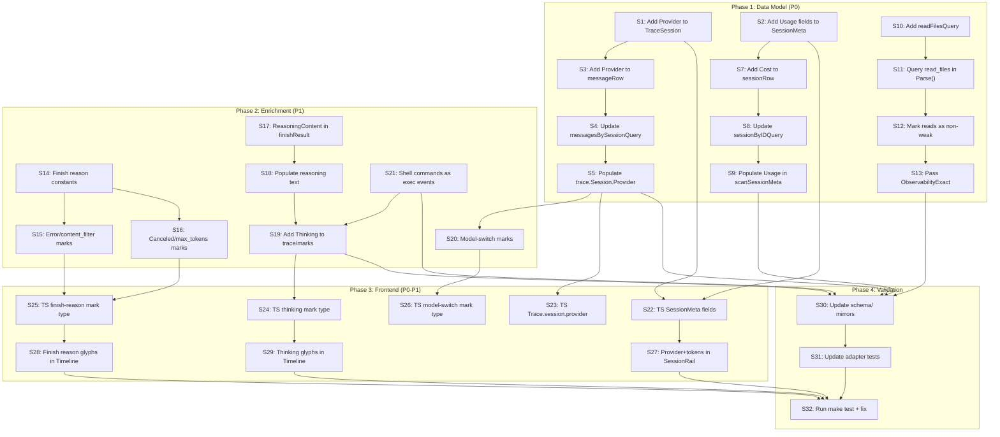

# Crush Integration Superb — Data Model & UI/UX Improvements

**Date:** 2026-08-04 02:49
**Status:** Planning
**Goal:** Close the gaps between what charmbracelet/crush records and what mindwalk surfaces

---

## Context: What Crush Records vs What Mindwalk Captures

### Crush SQLite Schema (4 tables)

| Table | Columns | Mindwalk Uses? |
|---|---|---|
| `sessions` | id, parent_session_id, title, message_count, prompt_tokens, completion_tokens, cost, updated_at, created_at, todos | **Partial** — id, title, timestamps, message_count only. **Missing:** prompt_tokens, completion_tokens, cost, todos |
| `messages` | id, session_id, role, parts (JSON), model, provider, created_at, updated_at, finished_at | **Partial** — id, role, parts, model, created_at. **Missing:** provider, finished_at |
| `files` | id, session_id, path, content, version, created_at, updated_at | **No** — entire table unused |
| `read_files` | session_id, path, read_at | **No** — entire table unused (would give exact read observability) |

### Crush Parts JSON (per message)

| Part Type | Fields | Mindwalk Uses? |
|---|---|---|
| `text` | text | **Yes** — user message marks |
| `reasoning` | thinking, signature, thought_signature, tool_id, started_at, finished_at | **No** — decoded then discarded |
| `tool_call` | id, name, input, provider_executed, finished | **Yes** — converted to events |
| `tool_result` | tool_call_id, name, content, data, mime_type, metadata, is_error | **Yes** — paired with tool calls |
| `finish` | reason (end_turn, max_tokens, tool_use, canceled, error, content_filter), time, message, details | **Partial** — only "stop" checked for user marks. **Missing:** error, content_filter, canceled, max_tokens |
| `shell_command` | command, output, exit_code | **No** — decoded then discarded |
| `image_url` | url, detail | **No** — decoded then discarded |
| `binary` | path, mime_type, data | **No** — decoded then discarded |

### Crush Capabilities (from README + source)

- Multi-model with mid-session switching
- Per-message `model` + `provider` columns
- LSP integration
- MCP servers (stdio, http, sse)
- Hooks
- Agent Skills (discovered from disk)
- Agent tool (subagents) with `parent_session_id`
- Permissions system
- Workspaces (shared sessions across clients)
- Bang-mode shell commands
- Reasoning/thinking content with signatures

---

## Pareto Breakdown

### 1% that delivers 51% of the result

| # | Task | Impact | Why |
|---|---|---|---|
| 1 | Add `Provider` to `TraceSession` + populate from messages.provider | High | Crush stores provider per message; we only capture model. UI can't show "Claude via Anthropic" vs "GPT-4 via OpenAI" |
| 2 | Add `Usage` (prompt_tokens, completion_tokens, cost) to `SessionMeta` + populate from sessions table | High | Token usage and cost are in the DB but invisible in UI. Huge for understanding session economics |
| 3 | Query `read_files` table for exact read observability | High | Upgrades crush from `ObservabilityEstimated` to `ObservabilityExact` for reads — a core quality metric |

### 4% that delivers 64% of the result

| # | Task | Impact | Why |
|---|---|---|---|
| 4 | Surface finish reasons (error, content_filter, canceled, max_tokens) as marks | Medium-High | Error and content_filter are session quality signals the judge and HUD should see |
| 5 | Surface reasoning/thinking content as a trace field + timeline indicator | Medium | Shows when agent was "thinking" vs acting — a major UX gap |
| 6 | Track provider/model switches across the session (not just first) | Medium | Crush supports mid-session model switching; we lose this entirely |

### 20% that delivers 80% of the result

| # | Task | Impact | Why |
|---|---|---|---|
| 7 | Surface shell commands (bang-mode) as exec events | Medium | Currently invisible; users can't see bang commands in the timeline |
| 8 | Add provider/token/cost display to SessionRail UI | High | The data is there but UI doesn't show it |
| 9 | Add finish reason indicators to Timeline UI | Medium | Visual markers for errors, refusals, cancellations |
| 10 | Add thinking/reasoning indicators to Timeline UI | Medium | Shows thinking phases in the playback |
| 11 | Update TypeScript types to match new model fields | Required | Frontend can't use data it doesn't type |

### Remaining 20% (deferred — lower ROI)

| # | Task | Impact | Why |
|---|---|---|---|
| D1 | Query `files` table for diff visualization | Low | Nice-to-have but large effort; defer |
| D2 | Surface `todos` field | Low | Minimal UI value; defer |
| D3 | MCP server awareness in UI | Low | No clear UI surface yet; defer |
| D4 | Hooks visibility | Low | No clear UI surface yet; defer |
| D5 | Skills usage tracking | Low | No clear UI surface yet; defer |

---

## Execution Plan — Medium Tasks (30-100 min each)

| # | Task | Est | Priority | Depends On |
|---|---|---|---|---|
| M1 | Add `Provider` + `Usage` fields to `model.TraceSession` and `model.SessionMeta` | 45m | P0 | — |
| M2 | Populate `Provider` from crush messages.provider column | 30m | P0 | M1 |
| M3 | Populate `Usage` (tokens + cost) from crush sessions table | 30m | P0 | M1 |
| M4 | Query `read_files` table; upgrade read observability to exact | 60m | P0 | — |
| M5 | Surface finish reasons as marks (error, content_filter, canceled, max_tokens) | 45m | P1 | — |
| M6 | Add `Thinking` content to trace events or marks | 60m | P1 | — |
| M7 | Track model+provider switches across the session | 45m | P1 | M1 |
| M8 | Surface shell commands as exec events | 45m | P1 | — |
| M9 | Update TypeScript types for all new fields | 30m | P0 | M1, M5, M6 |
| M10 | Add provider/token/cost display to SessionRail | 60m | P1 | M9 |
| M11 | Add finish reason indicators to Timeline | 45m | P1 | M9, M5 |
| M12 | Add thinking indicators to Timeline | 45m | P1 | M9, M6 |
| M13 | Update schema/ JSON mirrors + tests | 60m | P0 | M1-M8 |
| M14 | Run full test suite + fix failures | 45m | P0 | All |

## Execution Plan — Small Tasks (max 12 min each)

| # | Task | Est | Parent |
|---|---|---|---|
| S1 | Add `Provider string` field to `model.TraceSession` | 5m | M1 |
| S2 | Add `PromptTokens int64` + `CompletionTokens int64` + `Cost float64` to `model.SessionMeta` | 5m | M1 |
| S3 | Add `Provider` to `messageRow` scan target in crush adapter | 5m | M2 |
| S4 | Update `messagesBySessionQuery` to include `provider` column | 5m | M2 |
| S5 | Populate `trace.Session.Provider` from first non-null message provider | 8m | M2 |
| S6 | Update `listSessionsQuery` to include `prompt_tokens, completion_tokens` (already present) | 5m | M3 |
| S7 | Add `Cost float64` to `sessionRow` scan target | 5m | M3 |
| S8 | Update `sessionByIDQuery` to include `cost` column | 5m | M3 |
| S9 | Populate `SessionMeta.PromptTokens/CompletionTokens/Cost` in `scanSessionMeta` | 8m | M3 |
| S10 | Add `readFilesQuery` const for `SELECT path FROM read_files WHERE session_id = ?` | 5m | M4 |
| S11 | Query `read_files` in `Parse()` and build a set of read paths | 10m | M4 |
| S12 | Mark events targeting read_files paths as non-weak reads | 10m | M4 |
| S13 | Pass `ObservabilityExact` to `ComputeStats` when read_files was used | 5m | M4 |
| S14 | Add finish reason constants to crush adapter | 5m | M5 |
| S15 | Emit marks for error/content_filter finish reasons | 10m | M5 |
| S16 | Emit marks for canceled/max_tokens finish reasons | 8m | M5 |
| S17 | Add `ReasoningContent` to finishResult in parts.go | 8m | M6 |
| S18 | Populate reasoning text in partsParser from reasoning parts | 10m | M6 |
| S19 | Add `Thinking` slice to `model.Trace` or emit as marks | 10m | M6 |
| S20 | Track model+provider per message; emit "model-switch" marks | 10m | M7 |
| S21 | Decode shell_command parts into exec events | 10m | M8 |
| S22 | Add `provider`, `promptTokens`, `completionTokens`, `cost` to TS `SessionMeta` | 5m | M9 |
| S23 | Add `provider` to TS `Trace.session` | 5m | M9 |
| S24 | Add `thinking` mark type to TS `Mark` type | 5m | M9 |
| S25 | Add `finish-reason` mark type to TS `Mark` type | 5m | M9 |
| S26 | Add `model-switch` mark type to TS `Mark` type | 5m | M9 |
| S27 | Show provider + tokens in SessionRail session rows | 10m | M10 |
| S28 | Add finish reason glyph to Timeline marks | 10m | M11 |
| S29 | Add thinking glyph to Timeline marks | 10m | M12 |
| S30 | Update schema/ JSON mirror files | 10m | M13 |
| S31 | Update crush adapter tests for new fields | 10m | M13 |
| S32 | Run `make test` and fix failures | 12m | M14 |

---

## Mermaid Execution Graph

---

## Key Design Decisions

1. **Provider as TraceSession field** (not per-event): The session-level provider is the primary one; per-message providers are tracked via model-switch marks. This matches how `Model` already works.

2. **Usage on SessionMeta** (not TraceSession): Token counts and cost are session-level metadata from the `sessions` table, not trace-level. They appear in the rail and HUD, not in the playback events.

3. **read_files → ObservabilityExact**: When the `read_files` table has data for a session, we upgrade the read observability grade from "estimated" to "exact". This is the single highest-quality improvement — it means the HUD's read metrics are trustworthy for crush sessions.

4. **Finish reasons as marks** (not events): Finish reasons are turn boundaries, not tool actions. Marks are the right abstraction — they show in the timeline without polluting the event stream.

5. **Reasoning as marks** (not a separate trace field): Keeping the change minimal — a `thinking` mark at the seq where reasoning was observed, with the thinking text truncated in the note. A future "thinking lane" can expand from this.

6. **Shell commands as exec events**: Bang-mode shell commands are real executions with command + output + exit code. They map naturally to the existing `exec` action class.

7. **Model switches as marks**: A `model-switch` mark at the seq where a new model/provider was first observed, with the model name in the note. Lets users see when the agent switched LLMs mid-session.

---

## What This Does NOT Do (Deferred)

- **Files table**: File content snapshots could enable diff visualization but require a major new UI surface. Defer.
- **Todos field**: The `todos` column on sessions could surface task progress but has unclear UI placement. Defer.
- **MCP/hooks/skills visibility**: These are crush capabilities but have no natural representation in the citymap/timeline metaphor. Defer until a clear UX emerges.
- **Image/binary content**: These are attachments, not code actions. The current discard is correct for the citymap metaphor.
