# Crush Integration Superb — Data Model & UI/UX Improvements

**Date:** 2026-08-04 02:49
**Status:** Planning
**Goal:** Close every gap between what charmbracelet/crush records and what mindwalk surfaces, prioritizing user-visible value

---

## 1. Current State Audit

### 1.1 Crush SQLite Schema — What's Recorded vs What Mindwalk Uses

| Table        | Column              | Type         | Mindwalk                    | User Value Lost                                                           |
| ------------ | ------------------- | ------------ | --------------------------- | ------------------------------------------------------------------------- |
| `sessions`   | `id`                | TEXT PK      | ✅ Used                     | —                                                                         |
| `sessions`   | `parent_session_id` | TEXT         | ✅ Used (agent graph)       | —                                                                         |
| `sessions`   | `title`             | TEXT         | ✅ Used                     | —                                                                         |
| `sessions`   | `message_count`     | INTEGER      | ✅ Used (EventCount)        | —                                                                         |
| `sessions`   | `prompt_tokens`     | INTEGER      | ❌ **Scanned, discarded**   | User can't see token economics                                            |
| `sessions`   | `completion_tokens` | INTEGER      | ❌ **Scanned, discarded**   | User can't see token economics                                            |
| `sessions`   | `cost`              | REAL         | ❌ **Not even selected**    | User can't see session cost                                               |
| `sessions`   | `updated_at`        | INTEGER (ms) | ✅ Used (EndedAt)           | —                                                                         |
| `sessions`   | `created_at`        | INTEGER (ms) | ✅ Used (StartedAt)         | —                                                                         |
| `sessions`   | `todos`             | TEXT         | ❌ **Scanned, discarded**   | Agent's task tracking invisible                                           |
| `messages`   | `id`                | TEXT PK      | ✅ Used                     | —                                                                         |
| `messages`   | `session_id`        | TEXT FK      | ✅ Used                     | —                                                                         |
| `messages`   | `role`              | TEXT         | ✅ Used                     | —                                                                         |
| `messages`   | `parts`             | TEXT (JSON)  | ✅ Used                     | —                                                                         |
| `messages`   | `model`             | TEXT         | ✅ Used (first wins)        | Mid-session model switches invisible                                      |
| `messages`   | `provider`          | TEXT         | ❌ **Selected, never read** | Can't distinguish "Claude via Anthropic" vs "GPT-4 via OpenAI"            |
| `messages`   | `created_at`        | INTEGER (ms) | ✅ Used                     | —                                                                         |
| `messages`   | `updated_at`        | INTEGER (ms) | ❌ **Not selected**         | Message edit/retry invisible                                              |
| `messages`   | `finished_at`       | INTEGER (ms) | ❌ **Not selected**         | Per-message latency invisible — can't show "thinking time" vs "tool time" |
| `files`      | `id`                | TEXT PK      | ❌ **Entire table unused**  | Versioned file snapshots (content + version) invisible                    |
| `files`      | `session_id`        | TEXT FK      | ❌                          | —                                                                         |
| `files`      | `path`              | TEXT         | ❌                          | —                                                                         |
| `files`      | `content`           | TEXT         | ❌                          | Could enable before/after diff view                                       |
| `files`      | `version`           | INTEGER      | ❌                          | —                                                                         |
| `read_files` | `session_id`        | TEXT FK      | ❌ **Entire table unused**  | Exact read observability wasted — reads stay "estimated"                  |
| `read_files` | `path`              | TEXT         | ❌                          | —                                                                         |
| `read_files` | `read_at`           | INTEGER (s)  | ❌                          | —                                                                         |

### 1.2 Crush Parts JSON — What's Decoded vs What's Surfaced

| Part Type       | Fields                                                           | Decoded?   | Surfaced?                                                                  | User Value Lost                                                               |
| --------------- | ---------------------------------------------------------------- | ---------- | -------------------------------------------------------------------------- | ----------------------------------------------------------------------------- |
| `text`          | text                                                             | ✅         | ✅ User-message marks                                                      | —                                                                             |
| `reasoning`     | thinking, signature, started_at, finished_at                     | ✅ Decoded | ❌ **Discarded**                                                           | Agent's thinking process invisible in timeline                                |
| `tool_call`     | id, name, input, provider_executed, finished                     | ✅ Decoded | ⚠️ **Partial** — `provider_executed` and `finished` decoded but never used | Provider-executed tools (server-side) have empty targets — ROADMAP flags this |
| `tool_result`   | tool_call_id, name, content, data, mime_type, metadata, is_error | ✅ Decoded | ⚠️ **Partial** — metadata field decoded but not used                       | Structured tool metadata invisible                                            |
| `finish`        | reason, time, message, details                                   | ✅ Decoded | ⚠️ **Partial** — only "stop" checked for user marks                        | Error, content_filter, canceled, max_tokens finish reasons invisible          |
| `shell_command` | command, output, exit_code                                       | ✅ Decoded | ❌ **Discarded**                                                           | Bang-mode shell commands invisible in timeline                                |
| `image_url`     | url, detail                                                      | ✅ Decoded | ❌ Discarded                                                               | Correct — no citymap representation                                           |
| `binary`        | path, mime_type, data                                            | ✅ Decoded | ❌ Discarded                                                               | Correct — no citymap representation                                           |

### 1.3 Existing ROADMAP Items This Work Addresses

- ✅ "Investigate the Crush `provider_executed` flag" (ROADMAP line 30)
- ✅ "Cross-check the Crush parts parser against latest upstream" (ROADMAP line 27)
- ✅ "Surface adapter health in the UI" (ROADMAP line 75) — provider/cost is adapter metadata
- ✅ "Group sessions by project in the rail sidebar" (ROADMAP line 82) — project info from crush DB path

---

## 2. Pareto Analysis — By User Value, Not Data Availability

### The 1% that delivers 51% of the result

| #     | What                                                | User Value | Why This Is #1                                                                                                                                                                                                                                                                            |
| ----- | --------------------------------------------------- | ---------- | ----------------------------------------------------------------------------------------------------------------------------------------------------------------------------------------------------------------------------------------------------------------------------------------- |
| **1** | **Exact read observability via `read_files` table** | Critical   | The HUD's read/re-read metrics are currently `estimated` for crush. The `read_files` table has the ground truth — every file the agent actually opened. Upgrading to `exact` makes the entire stats panel trustworthy for crush sessions. This is the single highest-quality improvement. |
| **2** | **Session cost + token usage in the rail**          | Critical   | The `sessions` table has `prompt_tokens`, `completion_tokens`, and `cost`. These are first-class economics metrics. Users evaluating agent sessions need to know "this session cost $0.42 and used 50k tokens." Currently 100% invisible.                                                 |
| **3** | **Provider on the trace**                           | High       | Crush stores `provider` per message. The HUD shows `model` but not `provider`. For users running multiple providers (Anthropic, OpenAI, local Ollama), this is essential context. "claude-sonnet-4 via Anthropic" vs "claude-sonnet-4 via OpenRouter" are very different sessions.        |

### The 4% that delivers 64% of the result

| #     | What                                        | User Value  | Why                                                                                                                                                                                                                                                                              |
| ----- | ------------------------------------------- | ----------- | -------------------------------------------------------------------------------------------------------------------------------------------------------------------------------------------------------------------------------------------------------------------------------- |
| **4** | **Finish reasons as timeline marks**        | High        | `error`, `content_filter`, `canceled`, `max_tokens` are session quality signals. A `content_filter` means the provider refused. An `error` means the turn crashed. These are invisible in the timeline — the user sees a gap with no explanation.                                |
| **5** | **Reasoning/thinking content in timeline**  | High        | Crush records `reasoning` parts with `thinking` text and `started_at`/`finished_at` timestamps. This is the agent's inner monologue. Currently decoded then discarded. Surfacing it as a `thinking` mark with duration lets users see when the agent was "thinking" vs "acting." |
| **6** | **Model/provider switches as marks**        | Medium-High | Crush supports mid-session model switching — a headline feature. Mindwalk captures only the first model and loses all subsequent switches. A `model-switch` mark at the seq where a new model appears shows users exactly when and what changed.                                 |
| **7** | **Per-message duration from `finished_at`** | Medium-High | The `finished_at` column gives exact per-message wall-clock duration. Combined with `created_at`, this lets the timeline show how long each turn took — "the agent spent 45 seconds thinking, then 3 seconds executing tools." Currently not even selected.                      |

### The 20% that delivers 80% of the result

| #      | What                                            | User Value | Why                                                                                                                                                                                                                                                                                                                                                                       |
| ------ | ----------------------------------------------- | ---------- | ------------------------------------------------------------------------------------------------------------------------------------------------------------------------------------------------------------------------------------------------------------------------------------------------------------------------------------------------------------------------- |
| **8**  | **Shell commands (bang-mode) as exec events**   | Medium     | Crush's bang-mode shell commands are real executions with command + output + exit code. Currently decoded then discarded. They should appear as `exec` events in the timeline so users see every command the agent ran, not just tool-system calls.                                                                                                                       |
| **9**  | **`provider_executed` flag on tool calls**      | Medium     | When `provider_executed=true`, the tool was run server-side (e.g. computer use), not by crush locally. These calls have empty targets because the execution happened outside the filesystem. Currently they look like broken events with no explanation. A `provider_executed` flag on the event (or at minimum a different action classification) would make this clear. |
| **10** | **Provider + tokens + cost in SessionRail**     | High       | The data from #2 and #3 needs UI. Session rows should show provider and token count alongside the existing harness + call count.                                                                                                                                                                                                                                          |
| **11** | **Finish reason + thinking glyphs in Timeline** | Medium     | The marks from #4 and #5 need visual representation in the timeline strip. Error/content_filter needs a red glyph; thinking needs a distinct color.                                                                                                                                                                                                                       |
| **12** | **Provider + duration in HUD**                  | Medium     | The HUD's `hud-commit` line already shows model. It should also show provider and per-session duration (from started_at to ended_at, or from finished_at aggregation).                                                                                                                                                                                                    |

### Remaining 20% (deferred — low ROI or high effort)

| #   | What                                            | Why Deferred                                                                                                                                 |
| --- | ----------------------------------------------- | -------------------------------------------------------------------------------------------------------------------------------------------- |
| D1  | `files` table → diff visualization              | Large UI surface needed. The data (versioned file content) is rich but the UX (before/after diff viewer) is a separate project. Defer.       |
| D2  | `todos` column → task progress                  | The todos field is the agent's internal task tracking. Minimal UI placement — unclear where it goes in the citymap/timeline metaphor. Defer. |
| D3  | `updated_at` on messages → retry detection      | Low value — retries are visible as repeated tool calls already. Defer.                                                                       |
| D4  | `metadata` on tool_results → structured display | No clear UI surface. Defer.                                                                                                                  |
| D5  | MCP/hooks/skills visibility                     | These are crush capabilities with no natural representation in the citymap/timeline metaphor. Defer until a clear UX emerges.                |
| D6  | `image_url`/`binary` content                    | Correct to discard — no citymap representation. Non-goal.                                                                                    |

---

## 3. Risk Analysis

| Risk                                                    | Likelihood | Impact | Mitigation                                                                                                                                                         |
| ------------------------------------------------------- | ---------- | ------ | ------------------------------------------------------------------------------------------------------------------------------------------------------------------ |
| Adding fields to `model.SessionMeta` breaks JSON schema | Medium     | High   | Add fields with `omitempty` — old clients ignore unknown fields. Update `schema/trace.schema.json` in same change.                                                 |
| `read_files` table missing on older crush DBs           | Medium     | Low    | Guard with `IF TABLE EXISTS` or catch "no such table" error; fall back to `estimated`.                                                                             |
| `cost` column missing on older schemas                  | Low        | Low    | Already have `warnIfOldSchema` pattern; add `cost` to `expectedSchemaColumns` check.                                                                               |
| `provider` column NULL for some messages                | High       | Low    | Use `sql.NullString`; first non-null wins (same pattern as `model`).                                                                                               |
| `finished_at` NULL for in-progress messages             | Medium     | Low    | Use `sql.NullInt64`; skip duration calculation when NULL.                                                                                                          |
| Finish reason marks inflate mark count                  | Low        | Medium | Only emit marks for non-`stop`/non-`tool_use` reasons (the common ones). `end_turn` and `tool_use` are normal flow.                                                |
| Thinking marks add noise to timeline                    | Low        | Medium | Truncate thinking text to 200 chars in mark note. The mark is a visual indicator, not a full transcript.                                                           |
| Shell command events duplicate bash tool calls          | Medium     | High   | Only emit shell_command events when the command is NOT already captured as a `bash` tool call. Check for overlapping `bash`/`Bash` tool calls in the same message. |
| Frontend type changes break build                       | Low        | Medium | All new fields are optional (`?` suffix). Existing components ignore unknown fields.                                                                               |

---

## 4. Backward Compatibility

All changes are **additive** — no existing fields are removed or renamed.

- **Go model**: New fields use `omitempty` so zero values are omitted from JSON.
- **TypeScript types**: New fields use `?` (optional) so existing code doesn't break.
- **Schema files**: Updated to allow new optional fields; old traces remain valid.
- **Old crush DBs**: Missing columns/tables fall back gracefully (existing pattern).
- **Other adapters**: Unaffected — new fields are populated only by the crush adapter. Other adapters leave them zero/empty.

---

## 5. Execution Plan — Medium Tasks (30-100 min each)

Sorted by impact/effort ratio (highest first).

| #   | Task                                                                                               | Impact   | Effort | Ratio | Depends On |
| --- | -------------------------------------------------------------------------------------------------- | -------- | ------ | ----- | ---------- |
| M1  | Query `read_files` table; upgrade read observability to exact                                      | Critical | 45m    | ★★★★★ | —          |
| M2  | Add `Provider`, `PromptTokens`, `CompletionTokens`, `Cost` to `model.SessionMeta` + `TraceSession` | Critical | 30m    | ★★★★★ | —          |
| M3  | Populate Provider from crush `messages.provider`; track model+provider switches                    | High     | 40m    | ★★★★☆ | M2         |
| M4  | Populate token usage + cost from crush `sessions` table                                            | High     | 30m    | ★★★★☆ | M2         |
| M5  | Surface finish reasons (error, content_filter, canceled, max_tokens) as marks                      | High     | 35m    | ★★★★☆ | —          |
| M6  | Add reasoning/thinking content as marks with duration                                              | High     | 45m    | ★★★★☆ | —          |
| M7  | Surface shell commands (bang-mode) as exec events                                                  | Medium   | 40m    | ★★★☆☆ | —          |
| M8  | Handle `provider_executed` flag on tool calls                                                      | Medium   | 25m    | ★★★☆☆ | —          |
| M9  | Update TypeScript types for all new fields                                                         | Required | 25m    | —     | M2-M8      |
| M10 | Add provider + tokens + cost to SessionRail UI                                                     | High     | 45m    | ★★★★☆ | M9, M2     |
| M11 | Add finish reason + thinking glyphs to Timeline UI                                                 | Medium   | 35m    | ★★★☆☆ | M9, M5, M6 |
| M12 | Add provider + duration to HUD UI                                                                  | Medium   | 25m    | ★★★☆☆ | M9, M2     |
| M13 | Update `schema/` JSON mirror files                                                                 | Required | 20m    | —     | M2-M8      |
| M14 | Update crush adapter tests for all new behavior                                                    | Required | 45m    | —     | M1-M8      |
| M15 | Run full test suite + fix failures                                                                 | Required | 30m    | —     | All        |

**Total estimated effort:** ~9.5 hours

---

## 6. Execution Plan — Small Tasks (max 12 min each)

Every task below is independently committable and takes at most 12 minutes.

### Phase 1: Data Model (P0) — 65 min total

| #   | Task                                                                                                      | Est | Parent | Files Touched                        |
| --- | --------------------------------------------------------------------------------------------------------- | --- | ------ | ------------------------------------ |
| S1  | Add `Provider string` to `model.TraceSession` (omitempty)                                                 | 3m  | M2     | `internal/model/model.go`            |
| S2  | Add `PromptTokens int64`, `CompletionTokens int64`, `Cost float64` to `model.SessionMeta` (all omitempty) | 4m  | M2     | `internal/model/model.go`            |
| S3  | Add `Provider` to `messageRow` struct + update `messagesBySessionQuery` to include `provider`             | 5m  | M3     | `internal/adapter/crush/sessions.go` |
| S4  | Scan `provider` in message loop; track provider+model per message                                         | 8m  | M3     | `internal/adapter/crush/sessions.go` |
| S5  | Populate `trace.Session.Provider` from first non-null provider                                            | 5m  | M3     | `internal/adapter/crush/sessions.go` |
| S6  | Emit `model-switch` mark when provider/model changes mid-session                                          | 8m  | M3     | `internal/adapter/crush/sessions.go` |
| S7  | Add `Cost float64` to `sessionRow` + update `listSessionsQuery`/`sessionByIDQuery` to include `cost`      | 5m  | M4     | `internal/adapter/crush/sessions.go` |
| S8  | Populate `SessionMeta.PromptTokens/CompletionTokens/Cost` in `scanSessionMeta`                            | 8m  | M4     | `internal/adapter/crush/sessions.go` |
| S9  | Add `readFilesQuery` const: `SELECT path FROM read_files WHERE session_id = ?`                            | 3m  | M1     | `internal/adapter/crush/sessions.go` |
| S10 | Query `read_files` in `Parse()`; build a `map[string]bool` of read paths                                  | 10m | M1     | `internal/adapter/crush/sessions.go` |
| S11 | Mark events targeting read_files paths as non-weak; pass `ObservabilityExact` to `ComputeStats`           | 6m  | M1     | `internal/adapter/crush/sessions.go` |

### Phase 2: Enrichment (P1) — 95 min total

| #   | Task                                                                                                    | Est | Parent | Files Touched                                                |
| --- | ------------------------------------------------------------------------------------------------------- | --- | ------ | ------------------------------------------------------------ |
| S12 | Add finish reason constants (`finishError`, `finishContentFilter`, `finishCanceled`, `finishMaxTokens`) | 3m  | M5     | `internal/adapter/crush/parts.go`                            |
| S13 | Emit marks for error/content_filter finish reasons in `Parse()`                                         | 8m  | M5     | `internal/adapter/crush/sessions.go`                         |
| S14 | Emit marks for canceled/max_tokens finish reasons in `Parse()`                                          | 5m  | M5     | `internal/adapter/crush/sessions.go`                         |
| S15 | Add `ReasoningText` + `ReasoningDuration` to `finishResult` struct                                      | 5m  | M6     | `internal/adapter/crush/parts.go`                            |
| S16 | Populate reasoning text + duration from reasoning parts (started_at/finished_at)                        | 10m | M6     | `internal/adapter/crush/parts.go`                            |
| S17 | Emit `thinking` mark with truncated thinking text + duration in note                                    | 8m  | M6     | `internal/adapter/crush/sessions.go`                         |
| S18 | Add shell command decoding in `partsParser.add()` → emit as `adapter.ToolCall` with name="bash"         | 10m | M7     | `internal/adapter/crush/parts.go`                            |
| S19 | Wire shell command events into `finishResult.events` so they become trace events                        | 8m  | M7     | `internal/adapter/crush/parts.go`                            |
| S20 | Check `provider_executed` on tool calls; set a flag on the event when true                              | 10m | M8     | `internal/adapter/crush/parts.go`, `internal/model/model.go` |
| S21 | Add `ProviderExecuted bool` to `model.Event` (omitempty)                                                | 3m  | M8     | `internal/model/model.go`                                    |
| S22 | Add `AgentLinkMethodCrushAgentID` constant for crush-specific link method                               | 3m  | —      | `internal/model/agent.go`                                    |
| S23 | Update `AgentLinkMethodCrushAgentID` usage in `exactCrushAgentNode` (currently reuses codex constant)   | 5m  | —      | `internal/adapter/crush/agents.go`                           |

### Phase 3: Frontend (P0-P1) — 70 min total

| #   | Task                                                                                                      | Est | Parent | Files Touched                |
| --- | --------------------------------------------------------------------------------------------------------- | --- | ------ | ---------------------------- |
| S24 | Add `provider?`, `promptTokens?`, `completionTokens?`, `cost?` to TS `SessionMeta`                        | 5m  | M9     | `web/src/types.ts`           |
| S25 | Add `provider?` to TS `Trace.session`                                                                     | 3m  | M9     | `web/src/types.ts`           |
| S26 | Add `thinking` + `finish-reason` + `model-switch` to TS `Mark.type` union                                 | 5m  | M9     | `web/src/types.ts`           |
| S27 | Add `providerExecuted?` to TS `TraceEvent`                                                                | 3m  | M9     | `web/src/types.ts`           |
| S28 | Add provider + token count to SessionRail session rows                                                    | 10m | M10    | `web/src/ui/SessionRail.tsx` |
| S29 | Add cost display to SessionRail (formatted as $X.XX or "free")                                            | 8m  | M10    | `web/src/ui/SessionRail.tsx` |
| S30 | Add `finish-reason` mark glyph to Timeline (red for error/content_filter, orange for canceled/max_tokens) | 10m | M11    | `web/src/ui/Timeline.tsx`    |
| S31 | Add `thinking` mark glyph to Timeline (distinct color, pulse animation)                                   | 8m  | M11    | `web/src/ui/Timeline.tsx`    |
| S32 | Add `model-switch` mark glyph to Timeline                                                                 | 5m  | M11    | `web/src/ui/Timeline.tsx`    |
| S33 | Add provider to HUD `hud-commit` line (next to model)                                                     | 5m  | M12    | `web/src/ui/Hud.tsx`         |
| S34 | Add `MARK_LABEL` entries for new mark types                                                               | 3m  | M11    | `web/src/ui/Timeline.tsx`    |
| S35 | Add CSS for new mark glyph colors                                                                         | 5m  | M11    | `web/src/styles.css`         |

### Phase 4: Validation — 65 min total

| #   | Task                                                                         | Est | Parent | Files Touched                             |
| --- | ---------------------------------------------------------------------------- | --- | ------ | ----------------------------------------- |
| S36 | Update `schema/trace.schema.json` for new TraceSession + Event + Mark fields | 10m | M13    | `schema/trace.schema.json`                |
| S37 | Update `schema/agent-graph.schema.json` for new link method constant         | 5m  | M13    | `schema/agent-graph.schema.json`          |
| S38 | Add test: `read_files` query upgrades observability to exact                 | 10m | M14    | `internal/adapter/crush/sessions_test.go` |
| S39 | Add test: provider is populated from messages                                | 8m  | M14    | `internal/adapter/crush/adapter_test.go`  |
| S40 | Add test: token usage + cost populated from sessions table                   | 8m  | M14    | `internal/adapter/crush/sessions_test.go` |
| S41 | Add test: finish reason marks emitted for error/content_filter/canceled      | 8m  | M14    | `internal/adapter/crush/parts_test.go`    |
| S42 | Add test: thinking mark emitted with duration                                | 8m  | M14    | `internal/adapter/crush/parts_test.go`    |
| S43 | Add test: shell command produces exec event                                  | 8m  | M14    | `internal/adapter/crush/parts_test.go`    |
| S44 | Run `make test` and fix all failures                                         | 10m | M15    | —                                         |

**Total: 44 tasks, ~295 min (~5 hours of focused work)**

---

## 6. Mermaid Execution Graph

```mermaid
graph TD
    subgraph "Phase 1: Data Model — P0"
        S1["S1: Provider on TraceSession"]
        S2["S2: Usage fields on SessionMeta"]
        S3["S3: Provider in messageRow"]
        S4["S4: Scan provider per message"]
        S5["S5: Populate trace.Session.Provider"]
        S6["S6: model-switch marks"]
        S7["S7: Cost in sessionRow"]
        S8["S8: Populate Usage in scanSessionMeta"]
        S9["S9: readFilesQuery const"]
        S10["S10: Query read_files in Parse()"]
        S11["S11: Mark reads as exact"]
    end

    subgraph "Phase 2: Enrichment — P1"
        S12["S12: Finish reason constants"]
        S13["S13: Error/CF marks"]
        S14["S14: Canceled/max_tokens marks"]
        S15["S15: ReasoningText in finishResult"]
        S16["S16: Populate reasoning + duration"]
        S17["S17: thinking marks"]
        S18["S18: Shell command → ToolCall"]
        S19["S19: Shell commands in events"]
        S20["S20: provider_executed flag"]
        S21["S21: ProviderExecuted on Event"]
        S22["S22: Crush agent link constant"]
        S23["S23: Use crush link constant"]
    end

    subgraph "Phase 3: Frontend — P0/P1"
        S24["S24: TS SessionMeta fields"]
        S25["S25: TS Trace.provider"]
        S26["S26: TS mark types"]
        S27["S27: TS providerExecuted"]
        S28["S28: Provider+tokens in rail"]
        S29["S29: Cost in rail"]
        S30["S30: Finish reason glyphs"]
        S31["S31: Thinking glyphs"]
        S32["S32: Model-switch glyphs"]
        S33["S33: Provider in HUD"]
        S34["S34: MARK_LABEL entries"]
        S35["S35: CSS for new glyphs"]
    end

    subgraph "Phase 4: Validation"
        S36["S36: trace.schema.json"]
        S37["S37: agent-graph.schema.json"]
        S38["S38: Test read_files observability"]
        S39["S39: Test provider populated"]
        S40["S40: Test usage+cost"]
        S41["S41: Test finish reason marks"]
        S42["S42: Test thinking marks"]
        S43["S43: Test shell command events"]
        S44["S44: make test + fix"]
    end

    %% Phase 1 dependencies
    S1 --> S3
    S2 --> S7
    S3 --> S4
    S4 --> S5
    S5 --> S6
    S7 --> S8
    S9 --> S10
    S10 --> S11

    %% Phase 2 dependencies
    S12 --> S13
    S12 --> S14
    S15 --> S16
    S16 --> S17
    S18 --> S19
    S20 --> S21

    %% Phase 3 dependencies
    S1 --> S24
    S2 --> S24
    S5 --> S25
    S13 --> S26
    S14 --> S26
    S17 --> S26
    S6 --> S26
    S21 --> S27
    S24 --> S28
    S24 --> S29
    S26 --> S30
    S26 --> S31
    S26 --> S32
    S25 --> S33
    S26 --> S34
    S34 --> S35

    %% Phase 4 dependencies
    S1 --> S36
    S21 --> S36
    S26 --> S36
    S22 --> S37
    S11 --> S38
    S5 --> S39
    S8 --> S40
    S13 --> S41
    S14 --> S41
    S17 --> S42
    S19 --> S43
    S35 --> S44
    S38 --> S44
    S39 --> S44
    S40 --> S44
    S41 --> S44
    S42 --> S44
    S43 --> S44
```

---

## 7. Key Design Decisions

### 7.1 Provider as TraceSession field (not per-event)

The session-level provider is the primary one; per-message providers are tracked via `model-switch` marks. This matches how `Model` already works — first non-null wins, changes are marks.

### 7.2 Usage on SessionMeta (not TraceSession)

Token counts and cost are session-level metadata from the `sessions` table, not trace-level. They appear in the rail and HUD, not in playback events. This keeps the trace focused on actions, not economics.

### 7.3 read_files → ObservabilityExact

When the `read_files` table has data for a session, we upgrade the read observability grade from `estimated` to `exact`. This means:

- The HUD's re-read rate is trustworthy (no `~` prefix)
- The `rereadHint` tooltip changes from "inferred from shell commands" to the exact description
- The `errorCaveat` for reads disappears

The `read_files` table may not exist on older crush DBs (it was added in the second migration). We catch "no such table" and fall back to `estimated`.

### 7.4 Finish reasons as marks (not events)

Finish reasons are turn boundaries, not tool actions. Marks are the right abstraction — they show in the timeline strip without polluting the event stream. We emit marks only for non-normal reasons:

- `error` → red glyph, note "Turn ended with error: {message}"
- `content_filter` → red glyph, note "Turn refused by provider safety filter"
- `canceled` → orange glyph, note "Turn canceled"
- `max_tokens` → orange glyph, note "Turn hit token limit"
- `end_turn` → no mark (normal completion)
- `tool_use` → no mark (normal tool flow)

### 7.5 Reasoning as marks (not a separate trace field)

A `thinking` mark at the seq where reasoning was observed, with truncated thinking text and duration in the note. This is the minimal change — a future "thinking lane" in the timeline can expand from this data without a model change.

The `reasoningData` struct already has `StartedAt` and `FinishedAt` (Unix timestamps in seconds). Duration = `FinishedAt - StartedAt`. We format as "thinking 12s" in the mark note.

### 7.6 Shell commands as exec events

Bang-mode shell commands (`shell_command` parts) are real executions with `command`, `output`, and `exit_code`. They map naturally to the existing `exec` action class. We convert them to `adapter.ToolCall` with name="bash" and input={"command": command}, paired with a `ToolResult` containing the output and `IsError = exit_code != 0`.

**Risk: duplicate events.** If a message has both a `bash` tool call and a `shell_command` part for the same command, we'd emit two events. Mitigation: only emit shell_command events when no `bash`/`Bash` tool call in the same message has the same command string.

### 7.7 provider_executed as Event field

When `provider_executed=true`, the tool was run server-side. We add a `ProviderExecuted bool` field to `model.Event` so the UI can distinguish these. The HUD's "no file targets" warning can then say "provider-executed tool" instead of "cwd may not match repository."

### 7.8 Crush-specific agent link method

Currently `exactCrushAgentNode` reuses `AgentLinkMethodCodexAgentID` — a misnomer. We add `AgentLinkMethodCrushAgentID = "crush-agent-id"` and update the crush adapter to use it. This is a cosmetic fix that makes the agent graph schema honest about which harness produced the link.

---

## 8. What This Does NOT Do (Deferred with Justification)

| Item                                                | Why Deferred                                           | Future Trigger                                |
| --------------------------------------------------- | ------------------------------------------------------ | --------------------------------------------- |
| `files` table → diff visualization                  | Needs a diff viewer UI surface — a separate project    | When users request "show me what changed"     |
| `todos` column → task progress                      | No clear UI placement in citymap/timeline              | When a "task panel" surface is designed       |
| `updated_at` on messages → retry detection          | Retries already visible as repeated tool calls         | When the judge needs retry-aware analysis     |
| `metadata` on tool_results                          | No clear UI surface                                    | When structured tool output display is needed |
| MCP/hooks/skills visibility                         | No natural representation in citymap metaphor          | When a "capabilities" panel is designed       |
| `image_url`/`binary` content                        | Correct to discard — no citymap representation         | Non-goal                                      |
| Per-message `finished_at` → timeline duration bars  | Rich data but needs a new timeline visualization layer | When "duration view" is added to timeline     |
| `projects.json` → group sessions by project in rail | Needs UI restructure of SessionRail                    | When project grouping is requested            |

---

## 9. Testing Strategy

| Layer           | What                                   | How                                                                                                   |
| --------------- | -------------------------------------- | ----------------------------------------------------------------------------------------------------- |
| **Unit**        | Parts parser handles new part types    | Extend `parts_test.go`: shell_command → exec event, reasoning → thinking mark, finish reasons → marks |
| **Unit**        | Session metadata populated correctly   | Extend `sessions_test.go`: provider, tokens, cost, read_files observability                           |
| **Integration** | Trace from real fixture has new fields | Extend `fixture_test.go`: assert provider, token counts, thinking marks present                       |
| **Schema**      | JSON schema mirrors match Go structs   | Update `schema/*.schema.json` and verify with `go test ./schema/...`                                  |
| **Frontend**    | Types compile, components render       | `npm --prefix web run build` (TypeScript compilation is the gate)                                     |
| **Full**        | Everything works together              | `make test`                                                                                           |

---

## 10. Commit Strategy

Commits are grouped by phase for reviewability:

1. **"Add Provider, Usage, and Cost fields to data model"** — S1, S2, S7, S8, S21, S22
2. **"Populate Provider and Usage from Crush sessions and messages"** — S3, S4, S5, S6
3. **"Query read_files table for exact read observability"** — S9, S10, S11
4. **"Surface finish reasons as timeline marks"** — S12, S13, S14
5. **"Surface reasoning/thinking content as timeline marks"** — S15, S16, S17
6. **"Surface shell commands as exec events"** — S18, S19
7. **"Handle provider_executed flag on tool calls"** — S20
8. **"Use crush-specific agent link method constant"** — S23
9. **"Update TypeScript types for new model fields"** — S24, S25, S26, S27
10. **"Add provider, tokens, and cost to SessionRail UI"** — S28, S29
11. **"Add finish reason, thinking, and model-switch glyphs to Timeline"** — S30, S31, S32, S34, S35
12. **"Add provider to HUD"** — S33
13. **"Update schema mirrors and adapter tests"** — S36, S37, S38, S39, S40, S41, S42, S43
14. **"Run full test suite and fix failures"** — S44
