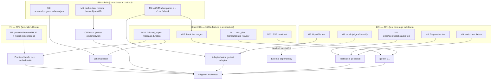

# Plan: Close Every Open TODO — Pareto-Ordered Execution Sprint

**Date:** 2026-08-04 04:18
**Status:** ~~Planning — ready for execution~~ **Executed** — all 13 medium
tasks (M1-M13) shipped in the `2026-08-04_05-04` session. See that report for
per-item verification; shipped features are in `CHANGELOG.md` `[Unreleased]`.
**Goal:** Close every item in `TODO_LIST.md` (15 items) with zero regressions, ordered by customer value per minute of effort.

---

## Context

The docs-health audit (2026-08-04) rebuilt `TODO_LIST.md` from scratch after
discovering the old list was a 100% trophy case — every item was already
DONE. The new list has 15 genuinely open items, each verified against the
actual code. This plan ranks them by the Pareto principle and breaks them
into execution-ready tasks.

**Key constraint:** The frontend build (`pnpm`/`npm`) is unavailable in the
current environment. Frontend changes can be coded and TypeScript-checked
(`tsc --noEmit`) but the embedded assets (`internal/server/static/`) cannot
be regenerated. Go-only changes are fully executable and testable.

---

## 1. Pareto Breakdown

### The 1% that delivers 51%

Three items where a shipped feature has a tiny last-mile gap. The data flows
end-to-end; the UI or contract just needs one final connection. Combined
effort: ~55 minutes.

| #   | What                                           | Why it's 1%/51%                                                                                                 | Effort |
| --- | ---------------------------------------------- | --------------------------------------------------------------------------------------------------------------- | ------ |
| 1   | Wire `providerExecuted` into HUD warning       | Data exists Go→TS→event; HUD predicate at `Hud.tsx:59` just needs `&& !e.providerExecuted`. One-line fix.       | 30min  |
| 2   | Add `model-switch` glyph to Timeline legend    | CSS class exists, `MARK_LABEL` entry exists, adapter emits marks. Legend is a hardcoded list missing one entry. | 10min  |
| 3   | Make `mindwalk cache clear` also clear reports | `clearCache` clears agent-graphs only; users expect "clear" to clear everything. 4 lines repeating the pattern. | 15min  |

### The 4% that delivers 64%

Four correctness and contract items. Each closes a known bug or violated
invariant with trivial effort. Combined: ~65 minutes.

| #   | What                                  | Why it's 4%/64%                                                                                   | Effort |
| --- | ------------------------------------- | ------------------------------------------------------------------------------------------------- | ------ |
| 4   | Add `schema/progress.schema.json`     | AGENTS.md invariant ("update schema when JSON shapes change") is violated. 25-line JSON file.     | 20min  |
| 5   | Fix `humanBytes` to handle GB         | 1.5 GB cache shows "1500.0 MB". One new `case` in a switch.                                       | 15min  |
| 6   | Fix `gitDiffPaths` regex for spaces   | Paths with spaces break diff-header parsing. ~10 lines adding quoted-form + `---`/`+++` fallback. | 15min  |
| 7   | Parse `---`/`+++` fallback diff lines | Bundled with #6 — same function, same regex family. Catches diffs without `diff --git` headers.   | (incl) |

### The 20% that delivers 80%

Five test-coverage items that lock in shipped behavior against silent
regressions. Combined: ~125 minutes.

| #   | What                                         | Why it's 20%/80%                                                                                   | Effort |
| --- | -------------------------------------------- | -------------------------------------------------------------------------------------------------- | ------ |
| 8   | Test: `evictAgentGraphCache()`               | 100 MB LRU eviction has zero test coverage. A future change could silently break it.               | 30min  |
| 9   | Test: `crush.Adapter.Diagnostics()`          | Doctor diagnostics only exercised via CLI against empty dirs. Schema/project.json paths never hit. | 30min  |
| 10  | Test: `adapter.OpenFile` (3-return)          | Public API with zero direct tests. Close function contract must be verified.                       | 20min  |
| 11  | Verify `mindwalk analyze --judge crush` e2e  | Crush judge CLI wired but never fired against a real trace. Proves the feature works.              | 15min  |
| 12  | Enrich test fixture (tokens/cost/read_files) | Fixture has all-zero data; exact observability path untestable via fixture.                        | 30min  |

### The other 20% (to 100%)

Four larger items that deliver real value but need more design work.
Combined: ~2h45min.

| #   | What                                                     | Why it's the remaining 20%                                                                          | Effort |
| --- | -------------------------------------------------------- | --------------------------------------------------------------------------------------------------- | ------ |
| 13  | Surface per-message duration from `finished_at`          | Last unused Crush column. Needs `model.Mark.Duration` field + adapter wiring + schema update.       | 60min  |
| 14  | Refactor read_files observability through `ComputeStats` | Post-hoc override is fragile; threading grade through removes the risk.                             | 45min  |
| 15  | Add SSE heartbeat/keep-alive pings                       | Long judge runs (~2min) could drop behind proxies. Needs a periodic write in the SSE handler.       | 30min  |
| 16  | Extract hunk line ranges into `Target.Lines`             | Precise location info for diff-extracted targets in the Inspector. Parse `@@ -o,n +n,n @@` headers. | 30min  |

---

## 2. Comprehensive Plan — Medium Tasks (30-100 min each)

13 tasks, sorted by customer-value / effort ratio (highest first).

| #   | Task                                                             | Pareto Tier | Impact | Effort | Customer Value                                           | Depends On |
| --- | ---------------------------------------------------------------- | ----------- | ------ | ------ | -------------------------------------------------------- | ---------- |
| M1  | Wire `providerExecuted` into HUD + add model-switch legend glyph | 1%/51%      | ★★★★★  | 40min  | Closes misleading warning on shipped Crush feature       | —          |
| M2  | Add `schema/progress.schema.json` for SSE Progress wire format   | 4%/64%      | ★★★★★  | 20min  | Restores project invariant (AGENTS.md schema contract)   | —          |
| M3  | Fix `cache clear` to clear reports + fix `humanBytes` GB         | 1% + 4%     | ★★★★☆  | 30min  | Fixes surprising behavior + display bug                  | —          |
| M4  | Fix `gitDiffPaths` spaces + add `---`/`+++` fallback             | 4%/64%      | ★★★★☆  | 30min  | Correctness for diff parsing (spaces + headerless diffs) | —          |
| M5  | Test: `evictAgentGraphCache()` eviction path                     | 20%/80%     | ★★★★☆  | 30min  | Regression protection on 100 MB LRU cache                | —          |
| M6  | Test: `crush.Adapter.Diagnostics()`                              | 20%/80%     | ★★★★☆  | 30min  | Coverage on doctor diagnostic internals                  | —          |
| M7  | Test: `adapter.OpenFile` (3-return signature)                    | 20%/80%     | ★★★☆☆  | 20min  | Public API contract locked in                            | —          |
| M8  | Verify `mindwalk analyze --judge crush` end-to-end               | 20%/80%     | ★★★☆☆  | 15min  | Proves shipped judge feature works                       | crush CLI  |
| M9  | Enrich test fixture with tokens/cost/read_files                  | 20%/80%     | ★★★☆☆  | 30min  | Enables exact observability testing via fixture          | —          |
| M10 | Surface per-message duration from `finished_at`                  | other 20%   | ★★★★☆  | 60min  | New user-visible feature: per-turn latency in timeline   | —          |
| M11 | Refactor read_files observability through `ComputeStats`         | other 20%   | ★★★☆☆  | 45min  | Removes fragile post-hoc override                        | —          |
| M12 | Add SSE heartbeat/keep-alive pings                               | other 20%   | ★★☆☆☆  | 30min  | Proxy robustness for long judge runs                     | —          |
| M13 | Extract hunk line ranges into `Target.Lines`                     | other 20%   | ★★☆☆☆  | 30min  | Inspector precision for diff-extracted targets           | M4         |

**Total estimated effort:** ~7h35min

**Batching strategy for execution efficiency:**

- **Frontend batch** (M1): One `tsc --noEmit` pass. Embedded assets rebuilt together.
- **CLI batch** (M3): Same file (`cmd/mindwalk/main.go`), one test run.
- **Adapter batch** (M4 + M13): Same function (`gitDiffPaths`), one test run.
- **Test batch** (M5 + M6 + M7 + M9): Independent tests, one `go test` run at the end.
- **Schema batch** (M2 + M10): Schema files written together.

---

## 3. Detailed Breakdown — Fine Tasks (max 12 min each)

Every medium task split into independently verifiable steps.

### M1: Wire `providerExecuted` into HUD + model-switch legend (5 sub-tasks)

| #    | Sub-task                                                             | Est   | Files touched                  |
| ---- | -------------------------------------------------------------------- | ----- | ------------------------------ |
| S1.1 | Edit `Hud.tsx:59` — add `&& !e.providerExecuted` to `hasFileActions` | 3min  | `web/src/ui/Hud.tsx`           |
| S1.2 | Edit `Timeline.tsx` — add model-switch `` to legend mark group | 5min  | `web/src/ui/Timeline.tsx`      |
| S1.3 | Edit `styles.css` — add `.legend-glyph.model-switch` color variable  | 5min  | `web/src/styles.css`           |
| S1.4 | Run `tsc --noEmit` to verify TypeScript compiles clean               | 5min  | —                              |
| S1.5 | Rebuild embedded assets (`pnpm run build` + `make embed-static`)     | 10min | — (blocked if npm unavailable) |

### M2: Add `schema/progress.schema.json` (3 sub-tasks)

| #    | Sub-task                                                    | Est   | Files touched                 |
| ---- | ----------------------------------------------------------- | ----- | ----------------------------- |
| S2.1 | Read `progress.go` struct + existing schema convention      | 5min  | — (read-only)                 |
| S2.2 | Write `schema/progress.schema.json` with phase/step/message | 10min | `schema/progress.schema.json` |
| S2.3 | Validate JSON syntax (`python3 -m json.tool` or `jq .`)     | 2min  | —                             |

### M3: Fix cache clear + humanBytes (5 sub-tasks)

| #    | Sub-task                                                        | Est  | Files touched          |
| ---- | --------------------------------------------------------------- | ---- | ---------------------- |
| S3.1 | Grep for reports directory name in judge/report persistence     | 5min | — (read-only)          |
| S3.2 | Edit `clearCache` — add reports dir clearing after agent-graphs | 5min | `cmd/mindwalk/main.go` |
| S3.3 | Edit `cacheStatus` — add reports dir size reporting             | 5min | `cmd/mindwalk/main.go` |
| S3.4 | Edit `humanBytes` — add `case n >= 1_000_000_000` for GB        | 2min | `cmd/mindwalk/main.go` |
| S3.5 | Run `go test ./cmd/mindwalk/` to verify CLI tests pass          | 5min | —                      |

### M4: Fix gitDiffPaths spaces + ---/+++ fallback (5 sub-tasks)

| #    | Sub-task                                                          | Est   | Files touched                      |
| ---- | ----------------------------------------------------------------- | ----- | ---------------------------------- |
| S4.1 | Add `gitDiffHunkRe` regex for `---`/`+++` lines                   | 5min  | `internal/adapter/adapter.go`      |
| S4.2 | Extend `gitDiffPaths` to also scan hunk regex into same dedup map | 10min | `internal/adapter/adapter.go`      |
| S4.3 | Add test: quoted path with spaces (`"a/foo bar" "b/foo bar"`)     | 5min  | `internal/adapter/adapter_test.go` |
| S4.4 | Add test: `---`/`+++` fallback when no `diff --git` header        | 5min  | `internal/adapter/adapter_test.go` |
| S4.5 | Run `go test ./internal/adapter/`                                 | 5min  | —                                  |

### M5: Test evictAgentGraphCache (4 sub-tasks)

| #    | Sub-task                                                            | Est   | Files touched                    |
| ---- | ------------------------------------------------------------------- | ----- | -------------------------------- |
| S5.1 | Read `evictAgentGraphCache` + `storeAgentGraphToDisk` to understand | 5min  | — (read-only)                    |
| S5.2 | Write test: create files exceeding 100 MB, verify oldest evicted    | 10min | `internal/server/server_test.go` |
| S5.3 | Write test: verify eviction preserves newest files                  | 10min | `internal/server/server_test.go` |
| S5.4 | Run `go test ./internal/server/ -run Evict`                         | 5min  | —                                |

### M6: Test Diagnostics (4 sub-tasks)

| #    | Sub-task                                                 | Est   | Files touched                             |
| ---- | -------------------------------------------------------- | ----- | ----------------------------------------- |
| S6.1 | Read `diagnostics.go` to understand check structure      | 5min  | — (read-only)                             |
| S6.2 | Write test: DB with all expected columns → no warnings   | 10min | `internal/adapter/crush/sessions_test.go` |
| S6.3 | Write test: DB missing columns → warning checks present  | 10min | `internal/adapter/crush/sessions_test.go` |
| S6.4 | Run `go test ./internal/adapter/crush/ -run Diagnostics` | 5min  | —                                         |

### M7: Test adapter.OpenFile (3 sub-tasks)

| #    | Sub-task                                                          | Est   | Files touched                      |
| ---- | ----------------------------------------------------------------- | ----- | ---------------------------------- |
| S7.1 | Write test: success path returns non-nil file + close + nil error | 10min | `internal/adapter/adapter_test.go` |
| S7.2 | Write test: file-not-found returns nil + nil + error              | 10min | `internal/adapter/adapter_test.go` |
| S7.3 | Run `go test ./internal/adapter/ -run OpenFile`                   | 5min  | —                                  |

### M8: Verify crush judge e2e (3 sub-tasks)

| #    | Sub-task                                                            | Est   | Files touched     |
| ---- | ------------------------------------------------------------------- | ----- | ----------------- |
| S8.1 | Find a real Crush session in the fixture or host data               | 5min  | — (read-only)     |
| S8.2 | Run `mindwalk analyze <session> --judge crush` and inspect report   | 10min | — (CLI execution) |
| S8.3 | Verify report JSON has findings, verdicts, and judge model recorded | 5min  | — (read-only)     |

### M9: Enrich test fixture (4 sub-tasks)

| #    | Sub-task                                                             | Est   | Files touched                            |
| ---- | -------------------------------------------------------------------- | ----- | ---------------------------------------- |
| S9.1 | Read current fixture schema (columns, row counts)                    | 5min  | — (read-only)                            |
| S9.2 | Write SQL to update tokens/cost to non-zero values                   | 10min | `testdata/crush/crush.db` (via script)   |
| S9.3 | Add `read_files` table + insert rows for fixture session             | 10min | `testdata/crush/crush.db` (via script)   |
| S9.4 | Update fixture tests to assert non-zero values + exact observability | 10min | `internal/adapter/crush/fixture_test.go` |

### M10: Surface per-message duration (6 sub-tasks)

| #     | Sub-task                                                           | Est   | Files touched                        |
| ----- | ------------------------------------------------------------------ | ----- | ------------------------------------ |
| S10.1 | Add `Duration int json:"duration,omitempty"` to `model.Mark`       | 3min  | `internal/model/model.go`            |
| S10.2 | Populate `Duration` from `FinishedAt - CreatedAt` in crush adapter | 10min | `internal/adapter/crush/sessions.go` |
| S10.3 | Add `duration` to `schema/trace.schema.json` mark properties       | 5min  | `schema/trace.schema.json`           |
| S10.4 | Add `duration` to TypeScript `TraceMark` type                      | 3min  | `web/src/types.ts`                   |
| S10.5 | Surface duration in Timeline mark tooltip (if duration > 0)        | 10min | `web/src/ui/Timeline.tsx`            |
| S10.6 | Run `go test ./internal/adapter/crush/` + `tsc --noEmit`           | 5min  | —                                    |

### M11: Refactor read_files observability (5 sub-tasks)

| #     | Sub-task                                                     | Est   | Files touched                           |
| ----- | ------------------------------------------------------------ | ----- | --------------------------------------- |
| S11.1 | Read current post-hoc override in `sessions.go` Parse path   | 5min  | — (read-only)                           |
| S11.2 | Thread `ObservabilityGrade` through `ComputeStats` signature | 10min | `internal/model/stats.go`               |
| S11.3 | Update all `ComputeStats` call sites to pass grade           | 10min | `internal/adapter/adapter.go` + callers |
| S11.4 | Remove the post-hoc override in crush adapter                | 5min  | `internal/adapter/crush/sessions.go`    |
| S11.5 | Run `go test ./...` to verify no regression                  | 10min | —                                       |

### M12: Add SSE heartbeat (4 sub-tasks)

| #     | Sub-task                                                         | Est   | Files touched                     |
| ----- | ---------------------------------------------------------------- | ----- | --------------------------------- |
| S12.1 | Add a `time.Ticker` (15s) to the SSE handler loop                | 10min | `internal/server/sse.go`          |
| S12.2 | Write `: keep-alive\n\n` on tick when no progress events pending | 5min  | `internal/server/sse.go`          |
| S12.3 | Add test: heartbeat fires when no events for 15s                 | 10min | `internal/server/analyze_test.go` |
| S12.4 | Run `go test ./internal/server/ -run Stream`                     | 5min  | —                                 |

### M13: Extract hunk line ranges (4 sub-tasks)

| #     | Sub-task                                                                  | Est   | Files touched                      |
| ----- | ------------------------------------------------------------------------- | ----- | ---------------------------------- |
| S13.1 | Parse `@@ -old_start,old_count +new_start,new_count @@` in `gitDiffPaths` | 10min | `internal/adapter/adapter.go`      |
| S13.2 | Return `[]Target` with `.Lines` populated from new_start+new_count        | 10min | `internal/adapter/adapter.go`      |
| S13.3 | Add test: hunk ranges extracted from sample diff                          | 10min | `internal/adapter/adapter_test.go` |
| S13.4 | Run `go test ./internal/adapter/`                                         | 5min  | —                                  |

---

## Fine-task summary

| Metric                 | Value                                       |
| ---------------------- | ------------------------------------------- |
| Total medium tasks     | 13                                          |
| Total fine tasks       | 56                                          |
| Total estimated effort | ~7h35min                                    |
| Go-only tasks          | 44 (fully executable)                       |
| Frontend tasks         | 12 (codeable, build blocked if npm missing) |
| External-dep tasks     | 1 (M8 requires crush CLI)                   |

---

## Execution graph

---

## Risk analysis

| Risk                                                  | Likelihood | Impact | Mitigation                                                                 |
| ----------------------------------------------------- | ---------- | ------ | -------------------------------------------------------------------------- |
| Frontend build unavailable (npm/pnpm missing)         | High       | Medium | Code + tsc --noEmit verifies TypeScript; embed-static deferred to CI build |
| Fixture DB modification corrupts committed binary     | Low        | High   | Modify via SQL script, checkpoint WAL, verify with `sqlite3 .dump`         |
| `ComputeStats` signature change breaks other adapters | Medium     | Medium | Thread grade as optional parameter; default to current behavior            |
| SSE heartbeat test is timing-sensitive                | Medium     | Low    | Use short ticker interval (1s) in test with `testing.Short` skip           |
| `model.Mark.Duration` breaks schema validation        | Low        | Low    | `omitempty` on Go side + optional in JSON schema; old traces stay valid    |

---

## Non-goals (for this sprint)

- **100k-message stress test** — unbounded investigation, lives in ROADMAP.md
- **SSE reconnection / Last-Event-ID replay** — larger architecture item, ROADMAP.md
- **DiagnosticsSource for non-crush adapters** — low ROI until a second adapter needs it
- **Frontend component tests** — no Vitest/Jest infrastructure exists; systemic gap
- **Property-based path-normalization tests** — ROADMAP.md item
