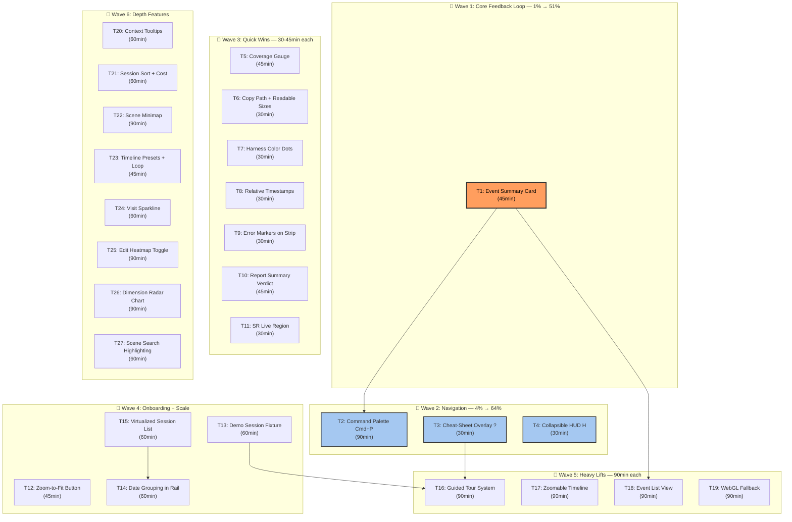

# SUPERB UI/UX Sprint — Pareto-Optimized Execution Plan

> **Created:** 2026-08-04 09:46
> **Source:** [docs/100-ui-ux-ideas.md](../100-ui-ux-ideas.md) — 100 ideas grounded in codebase analysis
> **Goal:** Deliver maximum UX improvement with minimum effort, in dependency-correct order

---

## 1. The Core Insight

mindwalk's core promise is: **"Play the session back as light moving through the map."**

That promise has a broken feedback loop today. When you scrub the timeline, the scene changes colors — but you have **no idea what event you're looking at**. The only readout is `seq/total` and a wall-clock timestamp. The event data (tool, action, targets, summary) is right there in `TraceEvent` but never surfaced during playback.

**This single gap separates "impressive visualization" from "understandable tool."**

Everything else — navigation, onboarding, scale, polish — is secondary to closing this loop.

---

## 2. Pareto Breakdown

### The 1% that delivers 51%

| # | Idea | Why |
|---|------|-----|
| **#41** | **Current event summary card** | Closes the core feedback loop. Without it, playback is meaningless. The data exists (`TraceEvent.tool`, `.action`, `.summary`, `.targets`); it's just not shown. ~45min of work transforms the entire product. |

### The 4% that delivers 64% (+13%)

| # | Idea | Why |
|---|------|-----|
| #41 | Current event summary card | (the 1%, above) |
| **#22** | **Fly-to-file command palette (Cmd+P)** | The scene can have 1000+ files. The only way to find one is visual scanning. Every modern dev tool has Cmd+P. Transforms navigation from "impractical" to "instant." |
| **#3** | **Keyboard cheat-sheet overlay (? key)** | 8+ shortcuts exist but are invisible in the UI. A `?` overlay unlocks the entire keyboard layer in 2 seconds. 30min of work. |
| **#56** | **Collapsible HUD (H key)** | The HUD always occupies screen space. One key to toggle it clean transforms screenshots, demos, and immersion. 30min of work. |

### The 20% that delivers 80% (+16%)

The above 4, plus these 16:

| # | Idea | Impact | Effort |
|---|------|--------|--------|
| #2 | Built-in demo session | Cold-start: new users with zero logs see nothing | 60min |
| #1 | Guided tour on first launch | Concept onboarding for the "light is data" metaphor | 90min |
| #9 | Session grouping by date | Flat list breaks past ~20 sessions | 60min |
| #10 | Relative timestamps | "2h ago" vs mental math on raw timestamps | 30min |
| #11 | Color-coded harness indicators | Instant source identification in the rail | 30min |
| #23 | Zoom-to-fit / recenter button | Scene navigation safety net | 45min |
| #42 | Zoomable timeline | 500+ event sessions are unreadable | 90min |
| #43 | Error markers on the strip | Failure hotspots visible at a glance | 30min |
| #45 | Event list view | Precise navigation for detailed review | 90min |
| #57 | Coverage gauge | The headline ratio (touched/total) is implied, not shown | 45min |
| #66 | Copy file path button | Basic clipboard ergonomics | 15min |
| #67 | Human-readable file sizes | "12.3 KB" instead of "12,698" | 15min |
| #83 | Report summary verdict line | Dense reports need a headline | 45min |
| #91 | Screen-reader live region | Accessibility core for playback | 30min |
| #96 | Virtualized session list | Performance for users with hundreds of sessions | 60min |
| #97 | WebGL detection + 2D fallback | Graceful degradation instead of blank canvas | 90min |

### The remaining 80% (the last 20% of value)

The other 80 ideas from the 100-list. These are depth features, polish, and ambitious extensions:
- Advanced scene layers (line-level heat, temporal arcs, co-edit connections, LOD clustering)
- Deep timeline features (multi-track, duration-based, bookmark bar, compare-two-points)
- Rich inspector (diff preview, file content, related files)
- Agent lens enhancements (Gantt view, comparison mode, follow-agent)
- Report depth (comparison view, trend chart, evidence snapshots)
- Full accessibility audit (high-contrast, keyboard file nav, focus management)
- Platform (tablet/touch, session prefetch, map build progress)

These are valuable but not urgent. They compound on top of the 20% foundation.

---

## 3. Execution Graph

**Reading the graph:** Waves are execution priority groups. Arrows show hard dependencies. Within a wave, tasks are parallelizable. T1 must ship before T2 and T18. T13 (demo) must exist before T16 (tour) can demonstrate it. T15 (virtualization) should precede T14 (date grouping) so grouping logic builds on virtualized rows.

---

## 4. Comprehensive Plan — Medium Granularity (30-100min tasks)

> Sorted by **impact × customer-value ÷ effort**. Each task is self-contained, testable, and shippable independently.

| ID | Wave | Task | Ideas | Impact | Effort | Customer Value | Key Files |
|----|------|------|-------|--------|--------|----------------|-----------|
| **T1** | 1 | **Event summary card** — floating card above the timeline showing the current event's tool, action, target files, and summary text. Closes the core playback feedback loop. | #41 | 🔴 Critical | 45min | "I understand what I'm looking at" | `Timeline.tsx`, new `EventSummary.tsx` |
| **T2** | 2 | **Command palette (Cmd+P)** — fuzzy file search overlay. Type a path, arrow through results, Enter flies the camera to that file. Indexes `city.files`. | #22 | 🔴 Critical | 90min | "I can find any file instantly" | New `CommandPalette.tsx`, `App.tsx`, scene camera API |
| **T3** | 2 | **Cheat-sheet overlay (? key)** — modal listing every keyboard shortcut with descriptions. Single keypress, click/Escape to dismiss. | #3 | 🟡 High | 30min | "I discover the keyboard layer" | New `CheatSheet.tsx`, `App.tsx` |
| **T4** | 2 | **Collapsible HUD (H key)** — toggle to hide the entire HUD overlay for clean screenshots and immersive viewing. Persists in localStorage. | #56 | 🟡 High | 30min | "I get a clean view when I want it" | `App.tsx`, `Hud.tsx` |
| **T5** | 3 | **Coverage gauge** — a compact progress ring showing "X% of repo files touched" using existing `fovea`/`filesInRepo` data. Sits in the HUD. | #57 | 🟡 High | 45min | "I see the headline metric at a glance" | `Hud.tsx` |
| **T6** | 3 | **Copy path + readable sizes** — clipboard icon on file paths in inspector/churn; "12.3 KB" instead of "12,698" bytes. | #66, #67 | 🟢 Medium | 30min | "Basic ergonomics feel right" | `Inspector.tsx`, `Hud.tsx` |
| **T7** | 3 | **Harness color dots** — small colored dot per session source in the rail: Claude (purple), Codex (green), Crush (blue), pi (amber). | #11 | 🟢 Medium | 30min | "I scan sessions by source instantly" | `SessionRail.tsx` |
| **T8** | 3 | **Relative timestamps** — "2h ago" alongside absolute time in session rows. Reduces cognitive load. | #10 | 🟢 Medium | 30min | "I don't do mental math on timestamps" | `SessionRail.tsx` |
| **T9** | 3 | **Error markers on strip** — red ticks on the timeline for events with `isError: true`. Failure clusters visible at a glance. | #43 | 🟡 High | 30min | "I see where things went wrong" | `Timeline.tsx` |
| **T10** | 3 | **Report summary verdict** — one-line overall assessment at the top of the evaluation panel, derived from dimension verdicts. | #83 | 🟡 High | 45min | "I get the gist before diving in" | `ReportPanel.tsx` |
| **T11** | 3 | **Screen-reader live region** — `aria-live="polite"` region announcing event changes during playback. Accessibility core. | #91 | 🟡 High | 30min | "Screen reader users can follow playback" | `Timeline.tsx` or `App.tsx` |
| **T12** | 4 | **Zoom-to-fit button** — single click reframes the entire map in view. Safety net for when users get lost after panning. | #23 | 🟡 High | 45min | "I never get stuck lost in the scene" | `CityScene.tsx`, `TreeScene.tsx`, scene camera API |
| **T13** | 4 | **Demo session fixture** — ship a small trace from `testdata/` as a loadable demo so new users see the visualization immediately. | #2 | 🔴 Critical | 60min | "I see value before I have my own data" | `server.go`, `App.tsx`, empty-state UI |
| **T14** | 4 | **Date grouping in rail** — collapsible sections: Today, Yesterday, This Week, Older. Flat list breaks past ~20 sessions. | #9 | 🟡 High | 60min | "I manage dozens of sessions" | `SessionRail.tsx` |
| **T15** | 4 | **Virtualized session list** — render only visible rows (react-window or similar). Keeps scrolling smooth with hundreds of sessions. | #96 | 🟢 Medium | 60min | "No jank with large session counts" | `SessionRail.tsx`, `package.json` |
| **T16** | 5 | **Guided tour system** — sequential callouts highlighting scene, timeline, dock panels on first launch. localStorage gated. | #1 | 🟡 High | 90min | "I understand the concept on first use" | New `GuidedTour.tsx`, `App.tsx` |
| **T17** | 5 | **Zoomable timeline** — scroll/pinch on the strip to zoom into dense regions. Overview minimap when zoomed. | #42 | 🔴 Critical | 90min | "I can read 500+ event sessions" | `Timeline.tsx` |
| **T18** | 5 | **Event list view** — scrollable, filterable list of all events synced to the scrubber. Click to jump. | #45 | 🟡 High | 90min | "I navigate precisely to any event" | New `EventList.tsx`, dock panel or sheet |
| **T19** | 5 | **WebGL detection + 2D fallback** — if WebGL unavailable, show a 2D treemap version. No blank canvas. | #97 | 🟡 High | 90min | "The app works everywhere" | New `Treemap2D.tsx`, `App.tsx` |
| **T20** | 6 | **Context tooltips** — inline "What am I looking at?" explanations on the HUD spectrum, dock buttons. Progressive disclosure. | #5, #7 | 🟢 Medium | 60min | "I learn without reading docs" | `Hud.tsx`, `Dock.tsx` |
| **T21** | 6 | **Session sort + cost display** — sort dropdown (newest, oldest, most events, most edits, highest cost). Show token/cost fields already in `SessionMeta`. | #13, #14 | 🟢 Medium | 60min | "I find sessions by what matters" | `SessionRail.tsx` |
| **T22** | 6 | **Scene minimap** — small corner overlay showing full repo layout with viewport rectangle. | #21 | 🟡 High | 90min | "I always know where I am" | New `Minimap.tsx`, scene API |
| **T23** | 6 | **Timeline presets + loop** — visible speed chips (not buried in menu); range-select for loop playback. | #44, #47 | 🟢 Medium | 45min | "Playback control is visible" | `Timeline.tsx` |
| **T24** | 6 | **Visit sparkline** — mini timeline in the inspector showing when the selected file was visited across the whole session. | #68 | 🟢 Medium | 60min | "I see a file's temporal context" | `Inspector.tsx` |
| **T25** | 6 | **Edit heatmap toggle** — a scene layer painting heat by edit count, independent of touch-state coloring. Directory click targets. | #24, #25 | 🟢 Medium | 90min | "I see edit density patterns" | `CityScene.tsx`, `TreeScene.tsx`, `ViewPanel.tsx` |
| **T26** | 6 | **Dimension radar chart** — compact radar showing the four evaluation dimensions for instant shape comparison. Severity filter. | #85, #86 | 🟢 Medium | 90min | "I compare evaluation shapes visually" | `ReportPanel.tsx` |
| **T27** | 6 | **Scene search highlighting** — type a path/glob, matching files brighten while non-matches dim. | #26 | 🟢 Medium | 60min | "I explore targeted file sets" | Scene components, `ViewPanel.tsx` |

**Totals:** 27 tasks · ~19.5 hours of focused work · 100% of the top-80% value

---

## 5. Detailed Breakdown — Fine Granularity (max 12min each)

> Every medium task broken into atomic, individually-verifiable steps. Sorted by parent task (execution order).

### T1: Event Summary Card (45min → 5 fine tasks)

| ID | Task | Time | Deps | Verify |
|----|------|------|------|--------|
| T1.1 | Create `web/src/ui/EventSummary.tsx` — skeleton component with props interface (event: TraceEvent, total: number) | 8min | — | Component renders null |
| T1.2 | Wire event data: render tool name, action badge (colored dot + word), target file paths (comma-joined, truncated), summary text | 10min | T1.1 | Shows real event data |
| T1.3 | CSS in `styles.css`: position above `.deck`, action-colored left border (reuse `--act-*` tokens), max-width truncation, text-sm | 10min | T1.2 | Styled correctly |
| T1.4 | Integrate into `Timeline.tsx`: render `<EventSummary>` above `.strip`, pass `event` and `total` | 8min | T1.3 | Card appears above timeline |
| T1.5 | Verify: scrub updates card in real-time, empty trace hides card, exporting locks card, error events show red badge | 9min | T1.4 | All cases work |

### T2: Command Palette (90min → 9 fine tasks)

| ID | Task | Time | Deps | Verify |
|----|------|------|------|--------|
| T2.1 | Create `web/src/ui/CommandPalette.tsx` — portal + backdrop + input field | 10min | — | Renders modal overlay |
| T2.2 | Build searchable index from `city.files`: map to `{path, lang, touch, fileId}` | 8min | T2.1 | Index populates on session load |
| T2.3 | Implement fuzzy filter: prefix match, substring match, path-segment match; score by relevance; limit to 12 results | 12min | T2.2 | Typing filters results live |
| T2.4 | Add `Cmd+P` / `Ctrl+P` global keydown listener in `App.tsx` — skip when typing in input/textarea | 8min | T2.1 | Palette opens on shortcut |
| T2.5 | Render results list: file path (dir dimmed, name bold), lang badge, touch-state colored dot | 10min | T2.3 | Results are readable |
| T2.6 | On select: call `selectFile(path)` to select + open inspector, then close palette | 8min | T2.5 | Clicking a result navigates |
| T2.7 | Keyboard navigation: ArrowUp/Down through results, Enter selects, Escape closes, Tab closes | 12min | T2.6 | Full keyboard control |
| T2.8 | CSS styling: backdrop blur, panel centered top-third, input with icon, result rows with hover/focus states, animate-in | 12min | T2.7 | Looks polished |
| T2.9 | Verify: type partial path gets right file, Enter navigates + highlights in scene, Escape returns focus, palette closes on session switch | 10min | T2.8 | All edge cases work |

### T3: Cheat-Sheet Overlay (30min → 4 fine tasks)

| ID | Task | Time | Deps | Verify |
|----|------|------|------|--------|
| T3.1 | Create `web/src/ui/CheatSheet.tsx` — modal overlay listing all shortcuts from `shortcuts.ts` | 10min | — | Modal renders shortcut list |
| T3.2 | Add `?` key listener in `App.tsx` — toggle visibility; skip when modifier keys held or typing in input | 8min | T3.1 | `?` opens, Escape closes |
| T3.3 | CSS: centered modal, semi-transparent backdrop, two-column layout (key → description), design tokens | 7min | T3.2 | Looks clean |
| T3.4 | Verify: `?` opens, Escape/click closes, shortcuts listed match actual bindings, doesn't fire while typing `?` in search | 5min | T3.3 | All cases pass |

### T4: Collapsible HUD (30min → 4 fine tasks)

| ID | Task | Time | Deps | Verify |
|----|------|------|------|--------|
| T4.1 | Add `hudHidden` boolean to Zustand store with setter + localStorage persistence | 8min | — | State toggles and persists |
| T4.2 | Add `H` key listener in `App.tsx` — toggle `hudHidden`; skip when typing in input | 7min | T4.1 | `H` hides/shows HUD |
| T4.3 | Conditionally render `<Hud>` based on `hudHidden` state in `App.tsx` | 5min | T4.2 | HUD appears/disappears |
| T4.4 | Verify: H toggles, persists across reload, doesn't fire while typing, dock panels still work when HUD hidden | 10min | T4.3 | All cases pass |

### T5: Coverage Gauge (45min → 5 fine tasks)

| ID | Task | Time | Deps | Verify |
|----|------|------|------|--------|
| T5.1 | Create `CoverageGauge` sub-component in `Hud.tsx` — SVG ring showing percentage | 10min | — | Ring renders |
| T5.2 | Compute coverage: `(editedNow + readNow + seenNow) / stats.filesInRepo * 100` | 8min | T5.1 | Correct percentage |
| T5.3 | Animate ring fill on playhead change (CSS transition on stroke-dashoffset) | 10min | T5.2 | Ring animates smoothly |
| T5.4 | Position in HUD: compact size in `hud-quiet` row or beside spectrum, with "X% covered" label | 9min | T5.3 | Fits HUD layout |
| T5.5 | Verify: percentage updates live during playback, 0% with no trace, handles division by zero | 8min | T5.4 | All cases pass |

### T6: Copy Path + Readable Sizes (30min → 4 fine tasks)

| ID | Task | Time | Deps | Verify |
|----|------|------|------|--------|
| T6.1 | Add `formatBytes(n)` utility: returns "12.3 KB", "1.2 MB", etc. | 8min | — | Function works |
| T6.2 | Replace `file.bytes.toLocaleString()` in `Inspector.tsx` with `formatBytes(file.bytes)` | 5min | T6.1 | Shows readable sizes |
| T6.3 | Add clipboard copy button (Clipboard icon from lucide) next to path in Inspector header and churn rows | 10min | — | Click copies to clipboard |
| T6.4 | Verify: size formats correctly at all scales, copy works, toast/feedback on copy | 7min | T6.3 | All cases pass |

### T7: Harness Color Dots (30min → 4 fine tasks)

| ID | Task | Time | Deps | Verify |
|----|------|------|------|--------|
| T7.1 | Define harness color map in `types.ts` or `SessionRail.tsx`: claude→purple, codex→green, crush→blue, pi→amber | 5min | — | Colors defined |
| T7.2 | Add colored dot element to `session-row` in `SessionRail.tsx` — small circle before title | 8min | T7.1 | Dots appear per session |
| T7.3 | CSS: `.harness-dot` with per-harness class, subtle glow matching scene touch aesthetic | 7min | T7.2 | Looks polished |
| T7.4 | Verify: each source gets distinct color, colors consistent, dot visible in active/inactive rows | 10min | T7.3 | All cases pass |

### T8: Relative Timestamps (30min → 4 fine tasks)

| ID | Task | Time | Deps | Verify |
|----|------|------|------|--------|
| T8.1 | Add `relativeTime(iso)` utility: "just now", "5m ago", "2h ago", "3d ago", "1w ago" | 10min | — | Function formats correctly |
| T8.2 | Display relative time in `session-meta` line in `SessionRail.tsx`, keep absolute as `title` tooltip | 8min | T8.1 | Shows "2h ago" |
| T8.3 | Handle edge cases: missing timestamp, future timestamps, invalid dates | 7min | T8.2 | No crashes on bad data |
| T8.4 | Verify: times are correct, update on refresh, tooltip shows full timestamp | 5min | T8.3 | All cases pass |

### T9: Error Markers on Strip (30min → 4 fine tasks)

| ID | Task | Time | Deps | Verify |
|----|------|------|------|--------|
| T9.1 | Compute error event positions in `Timeline.tsx`: filter `trace.events` for `isError`, map to seq positions | 8min | — | Array of error positions |
| T9.2 | Render red tick marks on the strip at error positions (like marks but distinct color) | 8min | T9.1 | Red ticks appear |
| T9.3 | CSS: `.strip-error` — thin red line, subtle glow, `title` showing the error summary | 7min | T9.2 | Styled and has tooltip |
| T9.4 | Verify: errors visible at a glance, hover shows summary, click could jump to error (reuse `X` shortcut pred) | 7min | T9.3 | All cases pass |

### T10: Report Summary Verdict (45min → 5 fine tasks)

| ID | Task | Time | Deps | Verify |
|----|------|------|------|--------|
| T10.1 | Derive summary line from dimension verdicts: aggregate pass/warn/fail into one sentence | 10min | — | Function returns summary |
| T10.2 | Render summary line at top of `ReportPanel.tsx` body, above dimensions | 8min | T10.1 | Line appears |
| T10.3 | Style: large text, colored based on overall verdict (green=pass, amber=warn, red=fail) | 10min | T10.2 | Styled correctly |
| T10.4 | Handle edge cases: no report, running, failed, dimensions-only (no rubric) | 9min | T10.3 | All states handled |
| T10.5 | Verify: summary matches verdicts, updates on re-evaluation, correct for all report states | 8min | T10.4 | All cases pass |

### T11: SR Live Region (30min → 3 fine tasks)

| ID | Task | Time | Deps | Verify |
|----|------|------|------|--------|
| T11.1 | Add visually-hidden `aria-live="polite"` div in `App.tsx` or `Timeline.tsx` | 8min | — | Region exists in DOM |
| T11.2 | Update region text on `currentSeq` change: "Event N of M: {tool} {action} — {summary}" | 10min | T11.1 | Region updates on scrub |
| T11.3 | Verify: screen reader announces event changes, region is visually hidden, doesn't interfere with other live regions | 12min | T11.2 | All cases pass |

### T12: Zoom-to-Fit Button (45min → 5 fine tasks)

| ID | Task | Time | Deps | Verify |
|----|------|------|------|--------|
| T12.1 | Expose a `resetCamera()` method from scene components via ref or callback | 10min | — | Method callable |
| T12.2 | Add zoom-to-fit button in scene overlay (crosshair/target icon, top-right area) | 8min | T12.1 | Button visible |
| T12.3 | Wire button: calls `resetCamera()` which recomputes `fitDistance` for all files and animates camera back | 10min | T12.2 | Camera resets |
| T12.4 | Animate camera transition (lerp position + target over ~0.5s, respect reduced-motion) | 9min | T12.3 | Smooth animation |
| T12.5 | Verify: button works in both tree and terrain views, during playback, after manual panning | 8min | T12.4 | All cases pass |

### T13: Demo Session Fixture (60min → 6 fine tasks)

| ID | Task | Time | Deps | Verify |
|----|------|------|------|--------|
| T13.1 | Select a compact trace from `testdata/` (claude-session.jsonl or crush fixture) and bundle it as a static asset | 10min | — | Fixture accessible |
| T13.2 | Add `/api/demo` endpoint in `server.go` that returns the bundled trace + a small citymap | 10min | T13.1 | Endpoint responds |
| T13.3 | Add "Try a demo session" button to the empty-stage state in `App.tsx` | 8min | T13.2 | Button appears when no sessions |
| T13.4 | Wire button: fetch demo trace/city, call `setData()` to load it without a real session | 10min | T13.3 | Demo loads on click |
| T13.5 | Style the button to be prominent in the empty-state card | 7min | T13.4 | Looks inviting |
| T13.6 | Verify: demo loads, timeline scrubs, scene renders, inspector works, no errors in console | 10min | T13.5 | Full demo works |

### T14: Date Grouping in Rail (60min → 7 fine tasks)

| ID | Task | Time | Deps | Verify |
|----|------|------|------|--------|
| T14.1 | Write `groupSessionsByDate(sessions)` utility: Today, Yesterday, This Week, This Month, Older | 10min | — | Groups computed correctly |
| T14.2 | Add collapsible section headers to `SessionRail.tsx` render | 10min | T14.1 | Sections appear |
| T14.3 | Track collapsed state per group in component state (or localStorage for persistence) | 8min | T14.2 | Sections collapse/expand |
| T14.4 | Apply after virtualization (T15) — if virtualized, group headers are sticky section dividers | 8min | T14.2 | Works with virtual list |
| T14.5 | CSS: section headers styled like `rail-foot` — uppercase, faint, with count badge | 8min | T14.3 | Looks clean |
| T14.6 | Handle edge cases: sessions with no `startedAt`, sessions from today at midnight | 8min | T14.5 | No crashes |
| T14.7 | Verify: groups correct, collapse persists, filter/search respects groups, active session scrolls into view | 8min | T14.6 | All cases pass |

### T15: Virtualized Session List (60min → 6 fine tasks)

| ID | Task | Time | Deps | Verify |
|----|------|------|------|--------|
| T15.1 | Evaluate `react-window` vs manual `IntersectionObserver` virtualization; add dependency if needed | 8min | — | Approach chosen |
| T15.2 | Wrap `session-list` items in virtualized container — render only visible rows + buffer | 12min | T15.1 | Only visible rows render |
| T15.3 | Preserve scroll position on rescan/session switch | 10min | T15.2 | Scroll doesn't jump |
| T15.4 | Ensure active session row scrolls into view on selection | 8min | T15.3 | Active row visible |
| T15.5 | Handle dynamic row heights (2-line titles) — use estimated height or measure | 10min | T15.4 | Variable heights work |
| T15.6 | Verify: 500 sessions scroll smoothly, memory profile flat, no visual glitches | 12min | T15.5 | All cases pass |

### T16: Guided Tour System (90min → 8 fine tasks)

| ID | Task | Time | Deps | Verify |
|----|------|------|------|--------|
| T16.1 | Create `web/src/ui/GuidedTour.tsx` — step manager with current step index, next/back/dismiss | 10min | — | Component manages steps |
| T16.2 | Define tour steps: each with target selector, title, description, placement | 12min | T16.1 | Steps defined |
| T16.3 | Render spotlight overlay: dim everything except the target element (CSS box-shadow trick or SVG mask) | 12min | T16.2 | Spotlight works |
| T16.4 | Render callout card: title, description, step indicator (2/5), Next/Back/Skip buttons | 10min | T16.3 | Callout renders |
| T16.5 | Gate on `localStorage` flag — show only on first launch, set flag on completion/skip | 8min | T16.4 | Shows once |
| T16.6 | Add "Replay tour" option in cheat-sheet or settings | 7min | T16.5 | Can replay |
| T16.7 | CSS: backdrop blur, callout card with design tokens, animate transitions between steps | 10min | T16.6 | Looks polished |
| T16.8 | Verify: tour covers key features, target highlighting accurate, doesn't block interaction, works with rail collapsed | 12min | T16.7 | All cases pass |

### T17: Zoomable Timeline (90min → 9 fine tasks)

| ID | Task | Time | Deps | Verify |
|----|------|------|------|--------|
| T17.1 | Add zoom state to `Timeline.tsx`: `zoomStart` (0-1) and `zoomEnd` (0-1), default 0-1 (full) | 8min | — | State exists |
| T17.2 | Map scrubber input to zoomed range instead of full 0..max | 10min | T17.1 | Scrubber respects zoom |
| T17.3 | Add zoom controls: scroll wheel on strip zooms toward cursor, +/- buttons | 10min | T17.2 | Wheel zooms |
| T17.4 | Recompute buckets within zoomed range | 8min | T17.3 | Histogram updates on zoom |
| T17.5 | Recompute mark positions within zoomed range | 8min | T17.4 | Marks reposition |
| T17.6 | Add overview minimap: thin strip above main strip showing full session with zoom window rectangle | 12min | T17.5 | Minimap visible |
| T17.7 | Make minimap draggable to pan the zoom window | 8min | T17.6 | Can drag to pan |
| T17.8 | CSS: minimap styling, zoom buttons, cursor changes (zoom-in on strip hover) | 8min | T17.7 | Looks clean |
| T17.9 | Verify: zoom works, scrubber accurate, marks/buckets update, minimap draggable, reset on session switch | 10min | T17.8 | All cases pass |

### T18: Event List View (90min → 8 fine tasks)

| ID | Task | Time | Deps | Verify |
|----|------|------|------|--------|
| T18.1 | Create `web/src/ui/EventList.tsx` — scrollable list component | 8min | — | Component renders |
| T18.2 | Render each event: seq number, action dot, tool name, target paths (truncated), summary, error icon if applicable | 12min | T18.1 | Events listed |
| T18.3 | Sync with playhead: highlight current event, auto-scroll to keep it visible | 10min | T18.2 | Current event highlighted |
| T18.4 | Click event row → call `onChange(seq)` to jump playhead | 8min | T18.3 | Click navigates |
| T18.5 | Add filter chips: All, Search, Read, Edit, Verify, Exec, Errors — filter list by action type | 10min | T18.4 | Filters work |
| T18.6 | Register as dock sheet panel ("Events") in `App.tsx` dock panel descriptors | 8min | T18.5 | Panel appears in dock |
| T18.7 | Virtualize for performance (events can number 500+) | 12min | T18.6 | Smooth scrolling |
| T18.8 | Verify: list syncs with scrubber, filters work, click jumps, virtualization smooth, works with zoomable timeline | 12min | T18.7 | All cases pass |

### T19: WebGL Fallback (90min → 8 fine tasks)

| ID | Task | Time | Deps | Verify |
|----|------|------|------|--------|
| T19.1 | Add WebGL detection utility: try creating WebGL context, catch failure | 8min | — | Detects WebGL availability |
| T19.2 | Create `web/src/scene/Treemap2D.tsx` — 2D canvas or SVG treemap using existing `CityMap` layout rects | 12min | — | 2D map renders |
| T19.3 | Port touch-state coloring to 2D: fill rects with the same `--act-*` / touch colors | 10min | T19.2 | Colors match 3D scene |
| T19.4 | Add playback support: highlight touched files at the current playhead (same `FilePlayback` data) | 10min | T19.3 | Playback works in 2D |
| T19.5 | Add click-to-select: clicking a rect opens the inspector (same `onSelect` API) | 8min | T19.4 | Inspector works |
| T19.6 | Add hover tooltip: reuse `SceneTip` pattern or simple title | 7min | T19.5 | Hover shows file info |
| T19.7 | Wire fallback in `App.tsx`: if no WebGL, render `Treemap2D` instead of scene | 8min | T19.6 | Fallback activates |
| T19.8 | Verify: 2D mode usable, playback syncs, inspector works, all features accessible without WebGL | 12min | T19.7 | All cases pass |

### T20: Context Tooltips (60min → 6 fine tasks)

| ID | Task | Time | Deps | Verify |
|----|------|------|------|--------|
| T20.1 | Add "What's this?" info icon next to HUD spectrum with expandable explanation | 10min | — | Icon appears |
| T20.2 | Add explanatory text for dock strip sections (hover tooltip on the section divider) | 8min | T20.1 | Tooltips appear |
| T20.3 | Add first-use micro-hint on play button (dismissible, localStorage gated) | 10min | T20.2 | Hint shows once |
| T20.4 | Add spectrum hover explanation: click each label to see what it means in context | 8min | T20.3 | Labels are interactive |
| T20.5 | CSS for all tooltip variants using existing `[data-hint]` pattern | 7min | T20.4 | Styled consistently |
| T20.6 | Verify: tooltips helpful, not annoying, dismiss correctly, don't block interaction | 10min | T20.5 | All cases pass |

### T21: Session Sort + Cost Display (60min → 6 fine tasks)

| ID | Task | Time | Deps | Verify |
|----|------|------|------|--------|
| T21.1 | Add sort dropdown to `SessionRail.tsx`: Newest, Oldest, Most Events, Most Edits, Highest Cost | 10min | — | Dropdown renders |
| T21.2 | Implement sort functions using existing `SessionMeta` fields | 8min | T21.1 | Sorting works |
| T21.3 | Display cost in session row when available: "$0.42" or "1.2k tokens" | 10min | T21.2 | Cost visible |
| T21.4 | Suppress zero-value cost/tokens (already pattern exists in rail) | 5min | T21.3 | Zeros hidden |
| T21.5 | Persist sort preference in localStorage (like `hideEmpty` and `harnessFilter`) | 8min | T21.4 | Preference persists |
| T21.6 | Verify: sorts correct, cost displays/suppresses, persists across reload, works with filters | 10min | T21.5 | All cases pass |

### T22: Scene Minimap (90min → 8 fine tasks)

| ID | Task | Time | Deps | Verify |
|----|------|------|------|--------|
| T22.1 | Create `web/src/ui/Minimap.tsx` — small canvas/SVG in corner of viewport | 10min | — | Component renders |
| T22.2 | Render simplified repo layout: rect per file/dir using `CityMap` layout, no 3D | 10min | T22.1 | Layout visible |
| T22.3 | Color rects by current touch state from `FilePlayback` | 8min | T22.2 | Colors update during playback |
| T22.4 | Compute camera viewport rectangle: project scene bounds to minimap coordinates | 12min | T22.3 | Rectangle shows view area |
| T22.5 | Update viewport rectangle on camera move (pan/zoom/orbit) | 10min | T22.4 | Rectangle tracks camera |
| T22.6 | Click on minimap → move camera target to that position | 8min | T22.5 | Click navigates |
| T22.7 | CSS: corner positioning, border, subtle background, pointer cursor | 7min | T22.6 | Looks clean |
| T22.8 | Verify: minimap updates during playback, viewport tracks camera, click navigates, doesn't overlap HUD/dock | 12min | T22.7 | All cases pass |

### T23: Timeline Presets + Loop (45min → 5 fine tasks)

| ID | Task | Time | Deps | Verify |
|----|------|------|------|--------|
| T23.1 | Move speed chips (1x/4x/16x) out of the `⋯` menu to visible position on the deck | 8min | — | Speed visible |
| T23.2 | Add loop toggle button: when on, playback wraps to loop start instead of stopping at end | 10min | T23.1 | Loop works |
| T23.3 | Add range-select: shift-drag on the strip to set loop range (two handles) | 12min | T23.2 | Range selectable |
| T23.4 | Persist loop preference in component state (not localStorage — session-specific) | 5min | T23.3 | Preference works |
| T23.5 | Verify: speeds visible, loop wraps correctly, range-select works, resets on session switch | 10min | T23.4 | All cases pass |

### T24: Visit Sparkline (60min → 6 fine tasks)

| ID | Task | Time | Deps | Verify |
|----|------|------|------|--------|
| T24.1 | Compute visit positions for selected file: map `history` events to 0-1 positions on the timeline | 10min | — | Positions computed |
| T24.2 | Render SVG sparkline in `Inspector.tsx`: thin bar with colored dots at visit positions | 10min | T24.1 | Sparkline renders |
| T24.3 | Color dots by action type (reuse `--act-*` tokens) | 8min | T24.2 | Dots colored |
| T24.4 | Add playhead indicator on sparkline: vertical line at `currentSeq / total` position | 8min | T24.3 | Playhead visible |
| T24.5 | Click on sparkline → jump playhead to that position | 8min | T24.4 | Click navigates |
| T24.6 | Verify: sparkline matches visit history, updates on playhead move, click jumps correctly | 12min | T24.5 | All cases pass |

### T25: Edit Heatmap Toggle (90min → 8 fine tasks)

| ID | Task | Time | Deps | Verify |
|----|------|------|------|--------|
| T25.1 | Add "Heat" toggle to `ViewPanel.tsx`: a third view mode or an overlay toggle | 8min | — | Toggle visible |
| T25.2 | Compute edit counts per file from trace events | 8min | T25.1 | Counts computed |
| T25.3 | Apply heat gradient to file colors in scene: 0 edits = base color, high edits = red glow | 12min | T25.2 | Heat visible |
| T25.4 | Add directory click targets: clicking a dir region shows aggregate stats (total files, touched, edits) | 10min | T25.3 | Directory clickable |
| T25.5 | Show aggregate stats in a small popover or in the inspector | 8min | T25.4 | Stats visible |
| T25.6 | Toggle between touch-state coloring and heat coloring smoothly | 8min | T25.5 | Smooth transition |
| T25.7 | CSS: legend update when heat mode active, show "edits" scale | 7min | T25.6 | Legend matches |
| T25.8 | Verify: heat accurate, directory stats correct, toggle works in both views, doesn't break playback | 12min | T25.7 | All cases pass |

### T26: Dimension Radar Chart (90min → 8 fine tasks)

| ID | Task | Time | Deps | Verify |
|----|------|------|------|--------|
| T26.1 | Create `RadarChart` sub-component in `ReportPanel.tsx` — SVG polygon with 4 axes | 10min | — | Radar renders |
| T26.2 | Map dimension verdicts to 0-1 scores: pass=1.0, warn=0.5, fail=0.0 | 8min | T26.1 | Scores correct |
| T26.3 | Draw radar polygon with labels: Exploration, Scope, Wandering, Verification | 10min | T26.2 | Polygon labeled |
| T26.4 | Color polygon by overall verdict (green/amber/red fill at low opacity) | 8min | T26.3 | Colored correctly |
| T26.5 | Add finding severity filter: toggle to show only critical/high findings, collapse rest | 10min | T26.4 | Filter works |
| T26.6 | Position radar at top of report body, above dimensions list | 7min | T26.5 | Layout correct |
| T26.7 | CSS: radar sizing, axis labels, grid rings, severity filter chips | 10min | T26.6 | Styled cleanly |
| T26.8 | Verify: radar matches verdicts, filter hides/shows findings, updates on re-evaluation | 12min | T26.7 | All cases pass |

### T27: Scene Search Highlighting (60min → 6 fine tasks)

| ID | Task | Time | Deps | Verify |
|----|------|------|------|--------|
| T27.1 | Add search input to `ViewPanel.tsx` or a new dock pop | 8min | — | Input visible |
| T27.2 | Implement glob/path matching against `city.files` | 10min | T27.1 | Matching works |
| T27.3 | Pass match set to scene components as a prop | 8min | T27.2 | Scene receives matches |
| T27.4 | In scene: matching files full brightness, non-matches dimmed to 20% opacity | 10min | T27.3 | Highlight visible |
| T27.5 | Clear highlighting when search cleared | 5min | T27.4 | Clears correctly |
| T27.6 | Verify: search highlights correct files, clears properly, works in both views, during playback | 10min | T27.5 | All cases pass |

---

## 6. Fine Task Summary

| Wave | Tasks | Fine Tasks | Total Time |
|------|-------|------------|------------|
| 1: Core Loop | 1 | 5 | 45min |
| 2: Navigation | 3 | 17 | 150min |
| 3: Quick Wins | 7 | 30 | 240min |
| 4: Onboarding + Scale | 4 | 24 | 225min |
| 5: Heavy Lifts | 4 | 33 | 360min |
| 6: Depth | 8 | 48 | 525min |
| **Total** | **27** | **157** | **~19.5h** |

---

## 7. Anti-Verschlimmbesserung Checklist

Before shipping ANY task, verify:

- [ ] **No existing behavior changed** — additive only, unless explicitly fixing a bug
- [ ] **`make test` passes** — Go tests + frontend build
- [ ] **`make build` succeeds** — embedded assets regenerate
- [ ] **No new dependencies** without justification — prefer existing libraries (lucide-react, zustand, three)
- [ ] **Design tokens respected** — use `--act-*`, `--moss`, `--amber`, etc., never hardcode colors
- [ ] **Keyboard shortcuts don't conflict** — check against existing bindings (Space, arrows, S, V, E, X, M, Cmd-B, H, ?)
- [ ] **Performance not regressed** — memoize new components, no re-renders on playback tick unless necessary
- [ ] **Accessibility maintained** — new buttons have `aria-label`, new overlays trap focus and close on Escape
- [ ] **localStorage keys namespaced** — prefix with `mindwalk.` to match existing convention
- [ ] **Reduced motion respected** — new animations check `prefersReducedMotion()`

---

## 8. Execution Rules

1. **Ship T1 first, alone.** It's the 1%. Nothing else matters until the core loop works.
2. **Wave 2-3 can be parallelized** — T3, T4, T6-T11 are independent 30min tasks. Knock them out in a batch.
3. **T13 (demo) before T16 (tour)** — the tour needs something to demonstrate.
4. **T15 (virtualize) before T14 (date groups)** — grouping logic builds on virtualized rows.
5. **T1 before T18 (event list)** — the event list reuses the event display logic from T1.
6. **Every task ships independently** — no half-finished features. Each is testable and valuable on its own.
7. **After each task: `make test && make build`** — never break the build.
8. **After each wave: commit** — detailed message, reference the idea numbers.
