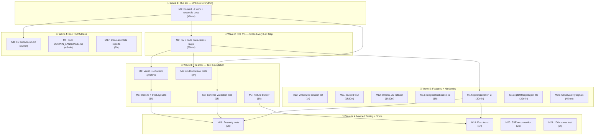

# SUPERB Sprint — Close Every Gap, Pareto-Ordered

> **Created:** 2026-08-04 10:22
> **Source:** TODO_LIST.md + docs-health self-review (50 items) + UI/UX sprint residual (3 open of 19) + code-coverage audit + doc-code drift findings
> **Goal:** Close every genuinely-open item with zero regressions, ordered by customer value per minute of effort.

---

## 0. Ground-Truth Audit — What Is ACTUALLY Open

Before planning, we must establish what is real. A sub-agent cross-checked every doc claim against source code. Key findings:

### Doc-code drift (critical discovery)

The TODO_LIST and docs-health report list ~20 UI/UX sprint tasks as 🔴 TODO. **16 of 19 are already shipped in code.** The components exist (`EventSummary.tsx`, `CommandPalette.tsx`, `CheatSheet.tsx`, `EventList.tsx`, etc.), the features work (coverage gauge, error markers, date grouping, zoom-to-fit, demo session, zoomable timeline, report verdict, SR live region). The docs lied.

**Action:** Reconcile TODO_LIST and FEATURES.md against code BEFORE adding new work.

### Genuinely open items (code-verified, 25 total)

| Category                 | Count | Items                                                                                                            |
| ------------------------ | ----- | ---------------------------------------------------------------------------------------------------------------- |
| Code correctness bugs    | 3     | `queryReadFiles` lint, `writeSSE` unchecked errors, `gitDiffTargets` global flag                                 |
| Dead code                | 1     | `finishData.Time` field                                                                                          |
| Missing tests            | 7     | Timestamp regression, schema-validation, rubriceval, Vitest setup, reducer/filters/treeLayout unit tests         |
| Missing tooling          | 2     | `golangci-lint` in CI, fixture builder script                                                                    |
| Missing adapter features | 1     | `DiagnosticsSource` on 3 adapters                                                                                |
| UI/UX genuinely open     | 3     | Virtualized session list (T15), Guided tour (T16), WebGL 2D fallback (T19)                                       |
| Documentation gaps       | 5     | crush.md multi-DB, DOMAIN_LANGUAGE.md, dynamic-rubric CLI check, 12 appendix-only reports, FEATURES.md re-verify |
| Refactors / performance  | 3     | `ObservabilitySignals` struct, SSE reconnection, 100k stress test                                                |

---

## 1. Pareto Breakdown

### The 1% that delivers 51%

**Commit the uncommitted working tree and reconcile docs with reality.**

The working tree has 10,553 insertions / 9,377 deletions of uncommitted UI/UX work. The TODO_LIST claims 16 shipped features are still open. Nobody can plan or work cleanly until the tree is committed and the docs tell the truth. This is ONE action that unblocks everything else.

### The 4% that delivers 64% (+13%)

**The five tiny code fixes that close every known correctness/lint gap.**

| Fix                                     | Effort | Impact                                                                |
| --------------------------------------- | ------ | --------------------------------------------------------------------- |
| `queryReadFiles` `rows.Err()`           | 10min  | Real correctness bug — SQLite partial results silently swallowed      |
| `TestTimestampsAreSecondsNotMillis`     | 15min  | Guards the most recent critical fix (`3f547fc`) against silent revert |
| Remove dead `finishData.Time`           | 10min  | Dead code that misleads readers                                       |
| Defensive comment at `secondsToRFC3339` | 5min   | Prevents a future "fix" back to milliseconds                          |
| `writeSSE` error handling               | 15min  | Broken pipe mid-judge-run silently spins                              |

Combined: ~55 minutes. Eliminates every known lint warning and correctness gap.

### The 20% that delivers 80% (+16%)

**Test infrastructure + doc truthfulness — the foundation for confident iteration.**

| Task                                          | Effort   | Impact                                                                |
| --------------------------------------------- | -------- | --------------------------------------------------------------------- |
| Schema-validation test (Go ↔ `schema/*.json`) | 1h       | Enforces a documented AGENTS.md invariant with zero enforcement today |
| Vitest setup + `reducer.ts` test              | 2h 30min | First frontend test ever; covers the core playback state machine      |
| `filters.ts` + `treeLayout.ts` unit tests     | 1h       | Two more pure-logic modules with zero coverage                        |
| `cmd/rubriceval` tests                        | 2h       | 0.0% coverage on 260 lines of concurrent logic                        |
| Fixture builder script                        | 1h       | The fixture is a black box; no regeneration path                      |
| Fix `docs/crush.md` multi-DB                  | 30min    | Active doc gives wrong session-discovery guidance                     |
| Build `docs/DOMAIN_LANGUAGE.md`               | 45min    | Missing living doc required by docs-health                            |
| Reconcile TODO_LIST + FEATURES                | 30min    | Remove 16 shipped items; docs stop lying                              |

### The other 20% (to 100%)

**The remaining open work — valuable but not blocking.**

| Task                                     | Effort   | Impact                                                |
| ---------------------------------------- | -------- | ----------------------------------------------------- |
| Virtualized session list (T15)           | 1h       | Performance for hundreds of sessions                  |
| Guided tour system (T16)                 | 1h 30min | Onboarding for the "light is data" metaphor           |
| WebGL 2D fallback (T19)                  | 1h 30min | Graceful degradation instead of blank canvas          |
| `DiagnosticsSource` on 3 adapters        | 1h       | Doctor command covers all adapters, not just crush    |
| `golangci-lint`/`staticcheck` in CI      | 30min    | Catch more than `go vet`                              |
| `gitDiffTargets` per-file tracking       | 20min    | Mixed diffs lose headerless files                     |
| `ObservabilitySignals` struct            | 45min    | Prevent `ComputeStats` parameter explosion            |
| Inline-annotate 12 appendix-only reports | 2h       | Fixes the docs-health #1 failure mode                 |
| Property/fuzz tests                      | 3h       | `normalizePath`, citymap determinism, adapter parsers |
| SSE `Last-Event-ID` reconnection         | 2h       | Long judge runs risk connection drops                 |
| 100k-message stress test                 | 2h       | Find the first performance bottleneck                 |

---

## 2. Comprehensive Plan — Medium Tasks (30–100 min each)

Every genuinely-open item, sorted by customer-value × effort ratio (highest first).

| #   | Task                                                         | Pareto Tier | Impact | Effort | Depends On |
| --- | ------------------------------------------------------------ | ----------- | ------ | ------ | ---------- |
| M1  | Commit uncommitted UI/UX work + reconcile TODO_LIST/FEATURES | 1%/51%      | ★★★★★  | 45min  | —          |
| M2  | Fix all 5 known code correctness/lint gaps (batch)           | 4%/64%      | ★★★★★  | 55min  | —          |
| M3  | Schema-validation test (Go types ↔ `schema/*.json`)          | 20%/80%     | ★★★★☆  | 1h     | —          |
| M4  | Set up Vitest + write `reducer.ts` unit test                 | 20%/80%     | ★★★★☆  | 2h 30m | —          |
| M5  | Write `filters.ts` + `treeLayout.ts` unit tests              | 20%/80%     | ★★★☆☆  | 1h     | M4         |
| M6  | Write `cmd/rubriceval` tests (0.0% → 60%+)                   | 20%/80%     | ★★★☆☆  | 2h     | —          |
| M7  | Write fixture builder script (`testdata/crush/build.go`)     | 20%/80%     | ★★★☆☆  | 1h     | —          |
| M8  | Fix `docs/crush.md` multi-DB staleness                       | 20%/80%     | ★★★☆☆  | 30min  | —          |
| M9  | Build `docs/DOMAIN_LANGUAGE.md`                              | 20%/80%     | ★★☆☆☆  | 45min  | —          |
| M10 | Virtualized session list (T15)                               | other 20%   | ★★☆☆☆  | 1h     | —          |
| M11 | Guided tour system (T16)                                     | other 20%   | ★★☆☆☆  | 1h 30m | —          |
| M12 | WebGL detection + 2D fallback (T19)                          | other 20%   | ★★☆☆☆  | 1h 30m | —          |
| M13 | Add `DiagnosticsSource` to claudecode/codex/pi adapters      | other 20%   | ★★☆☆☆  | 1h     | —          |
| M14 | Add `golangci-lint` / `staticcheck` to CI                    | other 20%   | ★★☆☆☆  | 30min  | —          |
| M15 | Fix `gitDiffTargets` per-file `hasDiffGit` tracking          | other 20%   | ★☆☆☆☆  | 20min  | —          |
| M16 | Extract `ObservabilitySignals` struct for `ComputeStats`     | other 20%   | ★☆☆☆☆  | 45min  | —          |
| M17 | Inline-annotate the 12 appendix-only status reports          | other 20%   | ★☆☆☆☆  | 2h     | —          |
| M18 | Property-based tests (`normalizePath`, citymap determinism)  | other 20%   | ★☆☆☆☆  | 2h     | —          |
| M19 | Fuzz test for adapter parsers                                | other 20%   | ★☆☆☆☆  | 1h     | —          |
| M20 | SSE `Last-Event-ID` reconnection support                     | other 20%   | ★☆☆☆☆  | 2h     | —          |
| M21 | 100k-message Crush stress test                               | other 20%   | ★☆☆☆☆  | 2h     | —          |

**Total estimated effort:** ~28 hours

---

## 3. Execution Graph

---

## 4. Fine-Grained Breakdown — Every Task Split to ≤12 min

### M1: Commit + Reconcile (45 min)

| #    | Sub-task                                                                                                   | Est   |
| ---- | ---------------------------------------------------------------------------------------------------------- | ----- |
| S1.1 | `git status` — review every uncommitted file, categorize mine vs not-mine                                  | 3min  |
| S1.2 | Read the diff summary for the 41 web/* files — confirm it's tabs reformat                                  | 5min  |
| S1.3 | Remove the 16 shipped items from TODO_LIST.md (event summary card, palette, etc)                           | 8min  |
| S1.4 | Update FEATURES.md — add rows for EventSummary, CommandPalette, CheatSheet, EventList, CoverageGauge, etc. | 10min |
| S1.5 | Add CHANGELOG entries for the UI/UX sprint waves that shipped                                              | 10min |
| S1.6 | `git add -A && git commit` with detailed message                                                           | 5min  |
| S1.7 | `git push`                                                                                                 | 2min  |
| S1.8 | Verify clean working tree (`git status`)                                                                   | 2min  |

### M2: Fix 5 Code Correctness/Lint Gaps (55 min)

| #    | Sub-task                                                                                                               | Est   |
| ---- | ---------------------------------------------------------------------------------------------------------------------- | ----- |
| S2.1 | Fix `queryReadFiles`: add `if err := rows.Err(); err != nil` after `Next()` loop at `sessions.go:925`                  | 5min  |
| S2.2 | Write `TestTimestampsAreSecondsNotMillis`: insert `time.Date(2026,1,1).Unix()`, assert `StartedAt` starts with `2026-` | 12min |
| S2.3 | Remove `Time int64` field from `finishData` struct at `parts.go:62`                                                    | 3min  |
| S2.4 | Add defensive comment at `secondsToRFC3339` (`sessions.go:899`) explaining the schema lie                              | 5min  |
| S2.5 | Fix `writeSSE`: wrap `fmt.Fprintf` in error check or document why it's safe                                            | 10min |
| S2.6 | Fix the heartbeat `fmt.Fprintf` at `sse.go:93` the same way                                                            | 5min  |
| S2.7 | Run `go test ./internal/adapter/crush/...` and `go test ./internal/server/...`                                         | 5min  |
| S2.8 | Run `go vet ./...` and confirm 0 warnings                                                                              | 3min  |
| S2.9 | Commit with message: "fix: close all known lint and correctness gaps"                                                  | 5min  |

### M3: Schema-Validation Test (1h)

| #    | Sub-task                                                                                                                               | Est   |
| ---- | -------------------------------------------------------------------------------------------------------------------------------------- | ----- |
| S3.1 | Read all 5 `schema/*.json` files and the Go types they mirror                                                                          | 10min |
| S3.2 | Design the test approach: marshal Go structs → validate against JSON schema using `github.com/santhosh-tekuri/jsonschema/v5` or manual | 10min |
| S3.3 | Write `internal/model/schema_test.go` — table-driven test for trace, report, agent-graph, citymap, progress                            | 25min |
| S3.4 | Add the `jsonschema` dependency or write a lightweight manual validator                                                                | 10min |
| S3.5 | Run `go test ./internal/model/...` — all schema tests pass                                                                             | 5min  |

### M4: Vitest Setup + Reducer Test (2h 30min)

| #     | Sub-task                                                                | Est   |
| ----- | ----------------------------------------------------------------------- | ----- |
| S4.1  | Read `web/package.json` — confirm no vitest dependency exists           | 3min  |
| S4.2  | `npm --prefix web install -D vitest @testing-library/react jsdom`       | 5min  |
| S4.3  | Create `web/vitest.config.ts` — basic config with jsdom environment     | 10min |
| S4.4  | Add `"test:unit": "vitest run"` script to `web/package.json`            | 3min  |
| S4.5  | Read `web/src/playback/reducer.ts` fully — understand state machine     | 10min |
| S4.6  | Write `web/src/playback/reducer.test.ts` — test initial state           | 10min |
| S4.7  | Add test: applying events advances playback state correctly             | 12min |
| S4.8  | Add test: file touch states transition correctly (seen → read → edited) | 12min |
| S4.9  | Add test: marks are accumulated in order                                | 10min |
| S4.10 | Add test: reset returns to initial state                                | 8min  |
| S4.11 | Add test: edge cases (empty events, duplicate seq, out-of-order)        | 12min |
| S4.12 | Run `npm --prefix web run test:unit` — all pass                         | 5min  |
| S4.13 | Wire `test:unit` into CI (`.github/workflows/ci.yml`)                   | 10min |

### M5: Filters + TreeLayout Tests (1h)

| #    | Sub-task                                                                           | Est   |
| ---- | ---------------------------------------------------------------------------------- | ----- |
| S5.1 | Read `web/src/state/filters.ts` — understand filter logic                          | 5min  |
| S5.2 | Write `web/src/state/filters.test.ts` — test each filter predicate                 | 12min |
| S5.3 | Add tests: filter combinations, empty input, all-matching                          | 10min |
| S5.4 | Read `web/src/scene/treeLayout.ts` — understand layout algorithm                   | 5min  |
| S5.5 | Write `web/src/scene/treeLayout.test.ts` — test deterministic layout               | 12min |
| S5.6 | Add tests: same input → same output, edge cases (empty, single node, deep nesting) | 12min |

### M6: cmd/rubriceval Tests (2h)

| #     | Sub-task                                                                    | Est   |
| ----- | --------------------------------------------------------------------------- | ----- |
| S6.1  | Read `cmd/rubriceval/main.go` fully — understand the tool                   | 10min |
| S6.2  | Identify testable functions (pure logic, CLI dispatch, trace loading)       | 10min |
| S6.3  | Create `cmd/rubriceval/main_test.go` — TestMain with env isolation          | 10min |
| S6.4  | Write test: CLI dispatch with valid args                                    | 12min |
| S6.5  | Write test: CLI dispatch with missing args (error path)                     | 10min |
| S6.6  | Write test: trace loading from fixture                                      | 12min |
| S6.7  | Write test: rubric evaluation smoke test (if a judge CLI is available)      | 12min |
| S6.8  | Write test: concurrent evaluation (if the tool runs concurrent judges)      | 12min |
| S6.9  | Run `go test ./cmd/rubriceval/...` — verify coverage jumps from 0%          | 5min  |
| S6.10 | Add `TestMain` env isolation (CRUSH_GLOBAL_DATA, MINDWALK_HOME → temp dirs) | 10min |
| S6.11 | Commit                                                                      | 5min  |

### M7: Fixture Builder Script (1h)

| #    | Sub-task                                                                                       | Est   |
| ---- | ---------------------------------------------------------------------------------------------- | ----- |
| S7.1 | Read existing fixture test helpers (`newFixtureDB`, `insertSession`, `insertMessage`)          | 10min |
| S7.2 | Design `testdata/crush/build.go` — a `go:generate` tool or standalone main                     | 10min |
| S7.3 | Write the builder: create schema, insert root session, sub-agent, messages with all part types | 25min |
| S7.4 | Add token/cost/read_files data (matching the current enriched fixture)                         | 10min |
| S7.5 | Run the builder, verify `go test ./...` still passes with the regenerated fixture              | 5min  |

### M8: Fix docs/crush.md Multi-DB (30min)

| #    | Sub-task                                                                                               | Est   |
| ---- | ------------------------------------------------------------------------------------------------------ | ----- |
| S8.1 | Read `docs/crush.md` fully                                                                             | 5min  |
| S8.2 | Add section: Multi-Database Discovery — `projects.json` registry, `enumerateDBPaths`, `sessionDBIndex` | 12min |
| S8.3 | Update the data-dir resolution section to reflect auto-discovery as the default                        | 8min  |
| S8.4 | Verify all code references are still accurate                                                          | 5min  |

### M9: Build docs/DOMAIN_LANGUAGE.md (45min)

| #    | Sub-task                                                                                                                        | Est   |
| ---- | ------------------------------------------------------------------------------------------------------------------------------- | ----- |
| S9.1 | Extract domain terms from AGENTS.md, model types, and adapter code                                                              | 10min |
| S9.2 | Write the glossary table (trace, session, harness, adapter, mark, target, event, citymap, agent graph, report, rubric, finding) | 20min |
| S9.3 | Add bounded-context notes where terms have different meanings                                                                   | 10min |
| S9.4 | Link from AGENTS.md                                                                                                             | 5min  |

### M10: Virtualized Session List (1h)

| #     | Sub-task                                                                          | Est   |
| ----- | --------------------------------------------------------------------------------- | ----- |
| S10.1 | Read `SessionRail.tsx` — understand current rendering loop                        | 5min  |
| S10.2 | Evaluate `react-window` vs CSS `content-visibility: auto` vs IntersectionObserver | 10min |
| S10.3 | Implement virtualization for session rows                                         | 25min |
| S10.4 | Test with 196 sessions (the host's real session count)                            | 10min |
| S10.5 | Verify date grouping still works with virtualization                              | 10min |

### M11: Guided Tour System (1h 30min)

| #     | Sub-task                                                            | Est   |
| ----- | ------------------------------------------------------------------- | ----- |
| S11.1 | Read the `onReplayTour` stub at `CheatSheet.tsx:6`                  | 5min  |
| S11.2 | Design tour steps (what to point at, what to say)                   | 15min |
| S11.3 | Create `web/src/ui/GuidedTour.tsx` — overlay with step highlighting | 25min |
| S11.4 | Wire tour trigger from CheatSheet "Replay tour" button              | 10min |
| S11.5 | Add tour state to Zustand store                                     | 10min |
| S11.6 | Style the tour overlay (CSS)                                        | 15min |
| S11.7 | Test: tour steps advance correctly, dismiss works                   | 10min |

### M12: WebGL Detection + 2D Fallback (1h 30min)

| #     | Sub-task                                                         | Est   |
| ----- | ---------------------------------------------------------------- | ----- |
| S12.1 | Write WebGL detection helper (`web/src/gl/detect.ts`)            | 10min |
| S12.2 | Create `web/src/scene/Treemap2D.tsx` — canvas-based 2D treemap   | 30min |
| S12.3 | Wire detection into `App.tsx` — render 2D or 3D based on support | 15min |
| S12.4 | Style the 2D view to match the 3D color vocabulary               | 15min |
| S12.5 | Add a "WebGL not available — using 2D mode" notice               | 5min  |
| S12.6 | Test on a WebGL-disabled browser                                 | 15min |

### M13: DiagnosticsSource on 3 Adapters (1h)

| #     | Sub-task                                                                      | Est   |
| ----- | ----------------------------------------------------------------------------- | ----- |
| S13.1 | Read `adapter.DiagnosticsSource` interface                                    | 5min  |
| S13.2 | Read crush `Diagnostics()` implementation as the reference                    | 5min  |
| S13.3 | Implement `Diagnostics()` on claudecode adapter (directory check, file count) | 15min |
| S13.4 | Implement `Diagnostics()` on codex adapter                                    | 15min |
| S13.5 | Implement `Diagnostics()` on pi adapter                                       | 15min |
| S13.6 | Test: `doctor` output now includes all 4 adapters                             | 5min  |

### M14: golangci-lint in CI (30min)

| #     | Sub-task                                                   | Est   |
| ----- | ---------------------------------------------------------- | ----- |
| S14.1 | Read `.github/workflows/ci.yml`                            | 3min  |
| S14.2 | Add `golangci-lint` step with a `.golangci.yml` config     | 12min |
| S14.3 | Run `golangci-lint run ./...` locally and fix any findings | 10min |
| S14.4 | Verify CI workflow is valid YAML                           | 5min  |

### M15: gitDiffTargets Per-File Tracking (20min)

| #     | Sub-task                                                               | Est   |
| ----- | ---------------------------------------------------------------------- | ----- |
| S15.1 | Read `gitDiffTargets` at `adapter.go:1017`                             | 5min  |
| S15.2 | Replace global `hasDiffGit` bool with per-file state struct            | 10min |
| S15.3 | Test: mixed diff (some `diff --git`, some headerless) parses all files | 5min  |

### M16: ObservabilitySignals Struct (45min)

| #     | Sub-task                                                             | Est   |
| ----- | -------------------------------------------------------------------- | ----- |
| S16.1 | Read `ComputeStats` signature at `model/stats.go`                    | 5min  |
| S16.2 | Define `ObservabilitySignals` struct (Reads, Errors, future signals) | 10min |
| S16.3 | Update `ComputeStats` to take the struct; update all 10 call sites   | 20min |
| S16.4 | Run `go test ./...` — all packages pass                              | 10min |

### M17: Inline-Annotate 12 Reports (2h)

| #     | Sub-task                                                                                         | Est                    |
| ----- | ------------------------------------------------------------------------------------------------ | ---------------------- |
| S17.1 | For each of the 12 appendix-only reports: read the numbered items in sections (c), (d), (e), (f) | 5min each × 12 = 60min |
| S17.2 | For each item: verify against code, apply inline `~~strikethrough~~` or `← still open` marker    | 5min each × 12 = 60min |

### M18: Property-Based Tests (2h)

| #     | Sub-task                                                                    | Est   |
| ----- | --------------------------------------------------------------------------- | ----- |
| S18.1 | Write property test for `normalizePath` (absolute, relative, cwd, symlinks) | 40min |
| S18.2 | Write property test for citymap determinism (same repo → same city)         | 40min |
| S18.3 | Write property test for `truncateNote` / `truncatePath` (boundary, unicode) | 30min |
| S18.4 | Run with `-race` and `-count=3`                                             | 10min |

### M19: Fuzz Tests for Adapter Parsers (1h)

| #     | Sub-task                                                                       | Est   |
| ----- | ------------------------------------------------------------------------------ | ----- |
| S19.1 | Write fuzz test for `decodeParts` (random JSON must not panic)                 | 20min |
| S19.2 | Write fuzz test for `gitDiffTargets` (random text must not panic or duplicate) | 20min |
| S19.3 | Write fuzz test for `crushModel` regex (random stderr must not panic)          | 20min |

### M20: SSE Last-Event-ID Reconnection (2h)

| #     | Sub-task                                                                   | Est   |
| ----- | -------------------------------------------------------------------------- | ----- |
| S20.1 | Read the SSE handler at `sse.go` and the EventSource client at `client.ts` | 10min |
| S20.2 | Add event ID tracking to `progressLog`                                     | 15min |
| S20.3 | Add `Last-Event-ID` header parsing in the SSE handler                      | 20min |
| S20.4 | Implement replay of missed events on reconnect                             | 30min |
| S20.5 | Test: client disconnects mid-run, reconnects, receives missed events       | 30min |
| S20.6 | Update `schema/progress.schema.json` with `id` field                       | 15min |

### M21: 100k-Message Stress Test (2h)

| #     | Sub-task                                                         | Est   |
| ----- | ---------------------------------------------------------------- | ----- |
| S21.1 | Write a fixture generator that creates a 100k-message crush.db   | 30min |
| S21.2 | Benchmark `ListSessions` against the large fixture               | 15min |
| S21.3 | Benchmark `Parse` against the large fixture                      | 15min |
| S21.4 | Identify the first bottleneck (likely per-row parts JSON decode) | 30min |
| S21.5 | Document findings; propose optimization if needed                | 30min |

---

## 5. Go Test Coverage Baseline (verified this session)

| Package                       | Coverage | Notes                                       |
| ----------------------------- | -------- | ------------------------------------------- |
| `cmd/mindwalk`                | 39.7%    | Subcommand wiring, flag parsing undertested |
| `cmd/rubriceval`              | **0.0%** | No test file exists                         |
| `internal/adapter`            | 73.8%    | Shared helpers                              |
| `internal/adapter/claudecode` | 83.9%    | —                                           |
| `internal/adapter/codex`      | 88.2%    | —                                           |
| `internal/adapter/crush`      | 82.7%    | —                                           |
| `internal/adapter/pi`         | 88.3%    | —                                           |
| `internal/citymap`            | 85.1%    | —                                           |
| `internal/judge`              | 78.6%    | `input.go`/`cache.go` thin                  |
| `internal/model`              | 96.2%    | —                                           |
| `internal/server`             | 76.3%    | Biggest package, most user-facing           |
| `internal/textutil`           | 100.0%   | —                                           |

---

## 6. Batching Strategy

- **Commit batch 1 (M1):** Commit uncommitted UI work + doc reconciliation. One commit.
- **Go batch (M2):** All 5 code fixes in one `go test` cycle, one commit.
- **Test batch (M3 + M6):** Schema test and rubriceval tests are independent Go tests; run together.
- **Frontend batch (M4 + M5):** Vitest setup + all frontend unit tests in one `npm` cycle.
- **Doc batch (M8 + M9):** Both doc fixes in one session.
- **Feature batch (M10–M13):** UI features and adapter diagnostics — independent, parallelizable.
- **CI batch (M14):** Single CI workflow edit.
- **Refactor batch (M15 + M16):** Both Go refactors in one test cycle.
- **Advanced batch (M18–M21):** Property, fuzz, SSE, stress — each independent.

---

## 7. Out of Scope (explicitly deferred)

- **The 80 remaining UI/UX ideas** from `docs/100-ui-ux-ideas.md` — these are raw ideas, not refined tasks. They enter the plan when they become actionable.
- **Replacing the hand-rolled SSE handler with `github.com/larsartmann/go-sse`** — a ROADMAP item, not a TODO. M20 adds reconnection to the current handler; full library swap is a separate decision.
- **Opening a PR upstream (`cosmtrek/mindwalk`)** — a ROADMAP open question, not actionable yet.
- **Adding more agent format adapters** (Aider, Goose, Cursor) — ROADMAP theme 1, not a current TODO.
