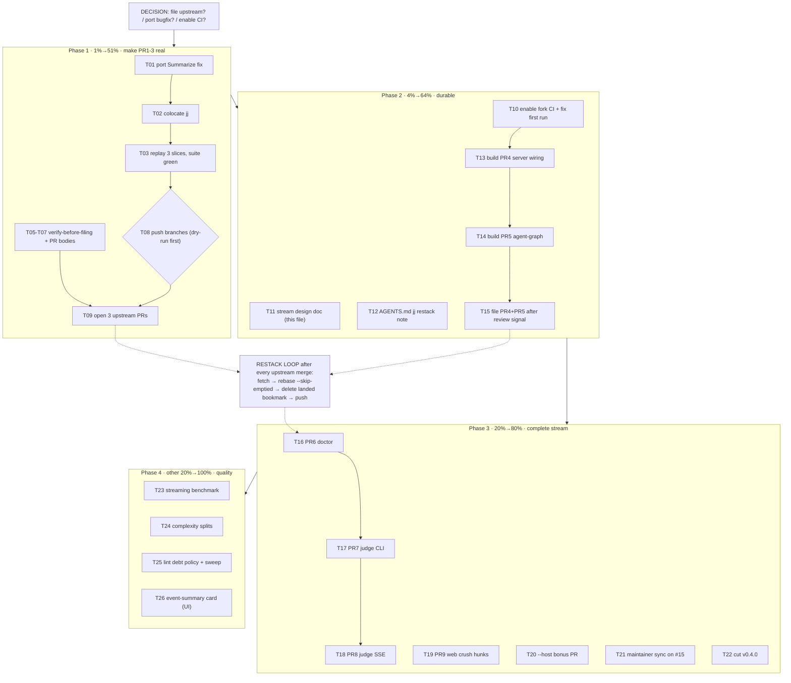

# SUPERB Plan: Upstream Landing Stream

- **Date:** 2026-09-09 04:05 CEST
- **Source of truth:** TODO_LIST.md (T24 decision), ROADMAP.md themes, status
  report `2026-09-09_04-00_upstream-pr-stream-design.md` section (f) (50
  items), and this session's verified findings. Every task below traces to
  one of those.
- **Standing constraint (Verschlimmbesserungsverbot):** no history rewrites
  beyond what already happened, no force-push without `--force-with-lease`,
  every slice boundary gated on a green full suite (`-count=1`), every
  upstream PR gated on a verify-before-filing pass. Additive, verified,
  reversible steps only.

## Where we are

- Fork master = upstream tip (`77cd795`) + 3 squashed fork commits
  (`98d291b`, `0932601`, `ad33cd9`). Working tree clean.
- 3 of 9 upstream PR slices are **built, tested, chain-verified** in
  `/tmp/jj-stack/` (PR1 model +592, PR2 adapter contract +2509, PR3 crush
  core +5749 incl. the `Summarize` clean-checkout bug fix).
- 0 pushes, 0 upstream PRs, fork CI has never run, 3 decisions open.

## Pareto breakdown

### 1% → 51%: The GO decision + filing PR1–3

The single highest-leverage act is **one decision** (upstream yes/no) plus
porting the already-built, already-verified slices and filing them. Nothing
else in the backlog produces upstream value; everything else is preparation
or polish around this. Concretely: port stack → push 3 branches → 3 PRs.

### 4% → 64%: Make the stream real and durable

- Port the `Summarize` bug fix to real master (local suite currently lies
  in clean checkouts)
- Enable fork CI (has never executed — zero real signal today)
- Read upstream's CI gates; verify-before-filing pass per PR
- Build + file PR4 (server wiring) and PR5 (agent-graph) — the two slices
  upstream reviewers will ask for immediately after PR3
- Capture the design in-repo (this document) + AGENTS.md jj-restack note

### 20% → 80%: The complete stream

- PR6 doctor, PR7 judge crush CLI, PR8 judge SSE, PR9 web crush hunks,
  `--host` bonus PR
- Maintainer sync on issue #15 ("is a crush-adapter PR welcome?")
- Cut fork release v0.4.0 (CHANGELOG trim + tag)

### The other 20% → 100%: quality backlog

- Streaming memory benchmark (the claim is still unmeasured)
- `Parse`/`readAgentLaunches`/`BuildAgentGraph` complexity splits
- Crush lint debt (211 warnings): policy + sweep
- Frontend event-summary card (the "core playback feedback loop is broken"
  item — highest user-visible gap), todo-state UI, fixture todos, remaining
  ROADMAP ideas

## Execution graph (mermaid)

## Comprehensive plan — medium granularity (30–100min each)

Sorted by importance → impact → effort → customer value. `Gate` = hard
dependency on you (the owner).

| # | Task | Phase | Impact | Effort | Value | Gate |
|---|------|-------|--------|--------|-------|------|
| T00 | Answer the 3 open decisions: file upstream now? port `Summarize` fix now? enable fork CI? | 0 | Critical | 0min | Unblocks everything | **YOU** |
| T01 | Port `Summarize` clean-checkout fix to real master + CHANGELOG entry + clean-checkout test verify | 1 | High | 30min | Honest local suite; PR3 integrity | — |
| T02 | Colocate jj into real repo (`jj git init --colocate`), sanity-check ref import, keep `rm -rf .jj` reversibility note | 1 | High | 30min | All later slicing + restacking | T00 |
| T03 | Replay the 3 sandbox slices onto upstream base as jj changes; full suite `-count=1` green at each boundary | 1 | Critical | 60min | The actual PR stack exists | T02 |
| T04 | Read upstream CI workflow; map its gates onto our validation (lint set, Go version, web build) | 2 | Med | 30min | PRs pass upstream CI first try | — |
| T05 | verify-before-filing PR1: premise re-check vs upstream HEAD + draft PR body (couplings, call-site blast radius) | 1 | High | 30min | Reviewer-ready PR1 | T03 |
| T06 | verify-before-filing PR2: premise re-check + body draft (helpers, contract, go directive) | 1 | High | 30min | Reviewer-ready PR2 | T03 |
| T07 | verify-before-filing PR3: premise re-check + body draft (fixture, dep, bug-fix note, package atomicity) | 1 | High | 30min | Reviewer-ready PR3 | T03 |
| T08 | Push `pr1-model`/`pr2-adapter`/`pr3-crush` to origin: `jj git push --dry-run` first, then push (never touch `master` ref) | 1 | Critical | 30min | Branches live on fork | T05–T07 |
| T09 | Open 3 upstream PRs via `gh pr create` (merge-order labels, stack cross-links, #15 signal citation) | 1 | Critical | 30min | **The 51% moment** | T08 |
| T10 | Enable fork GitHub Actions; trigger first run; fix whatever is red | 2 | High | 60min | Real CI signal forever | T00 |
| T11 | Finalize this stream design doc in-repo (this file; add measured PR sizes as slices land) | 2 | Med | 30min | Durable context | — |
| T12 | Record the jj restack loop (fetch → `--skip-emptied` → delete landed → push) in AGENTS.md | 2 | Med | 30min | Future sessions restack correctly | T02 |
| T13 | Build PR4 slice: server crush wiring + `/api/adapters` + flags; suite green | 2 | High | 90min | Reviewers' first follow-up ask | T03 |
| T14 | Build PR5 slice: agent-graph endpoint + cache + eviction; suite green | 2 | High | 90min | Agent Lens upstream | T13 |
| T15 | File PR4+PR5 once PR1–3 show review movement; restack as needed | 2 | Med | 30min | Stream continues | T13, T14 |
| T16 | Build PR6 slice: doctor + `Closer` lifecycle + JSONL `Diagnostics()` | 3 | Med | 60min | Health checks upstream | T15 |
| T17 | Build PR7 slice: judge crush CLI + rubric/cache/input improvements + rubriceval delta decision | 3 | Med | 90min | Evaluation parity | T15 |
| T18 | Build PR8 slice: judge progress SSE (`progress.go`, `sse.go`, schema) | 3 | Med | 90min | UX of evaluation | T17 |
| T19 | Research actual crush hunks in web/src; build + size PR9 | 3 | Med | 60min | Harness parity in UI | T13 |
| T20 | `--host` LAN-bind bonus PR (small, independent) | 3 | Med | 30min | Universally useful | — |
| T21 | Maintainer sync comment on issue #15: "crush adapter PRs incoming — welcome?" | 3 | High | 30min | De-risks the whole stream | T09 |
| T22 | Cut fork release v0.4.0: CHANGELOG section trim, tag, verify `go get`/proxy | 3 | Med | 90min | Distribution hygiene | T10 |
| T23 | Streaming memory benchmark: huge synthetic session, allocs/peak-heap, old-vs-new benchstat; pin baseline | 4 | Med | 60min | Turns claim into number | — |
| T24 | Complexity splits: `Parse` (gocognit 78), `readAgentLaunches` (cyclop 15), `BuildAgentGraph` (39) | 4 | Med | 100min | Reviewability, lint headroom | — |
| T25 | Crush lint debt: decide policy (fix vs configure varnamelen/wrapcheck allowlists), first sweep | 4 | Low-Med | 100min | Signal-to-noise in reviews | — |
| T26 | Frontend event-summary card during playback (the "broken core feedback loop" — highest user-visible gap) | 4 | High (user) | 100min | The product's biggest UX gap | — |

**Total: 27 tasks (T00 decision + 26 work items).**

## Detailed breakdown — fine granularity (≤12min each)

Every medium task above, exploded. Sorted the same way (phase order =
importance order). IDs are `Txx.y`.

| # | Micro-task | Parent | Est |
|---|-----------|--------|-----|
| T01.1 | Apply one-line `Summarize` nil-DB → `NotRecognizedErr` fix in real repo | T01 | 5min |
| T01.2 | Add CHANGELOG Fixed entry (clean-checkout failure, local `.crush` masking) | T01 | 5min |
| T01.3 | Verify in a pristine `git clone` of the fork: test now fails→passes without `.crush` | T01 | 10min |
| T01.4 | gofmt + `go test ./internal/adapter/crush/` + full suite | T01 | 10min |
| T02.1 | Confirm clean tree (`git status`), read colocation caveat notes | T02 | 5min |
| T02.2 | Run `jj git init --colocate`; inspect `jj log` import (all refs present) | T02 | 10min |
| T02.3 | Dry-run one `jj git push --dry-run` to origin; confirm nothing moves | T02 | 10min |
| T02.4 | Write reversibility note (`rm -rf .jj`) into AGENTS.md dev section | T02 | 5min |
| T03.1 | Create PR1 change on upstream tip; port model+schema+7 call-site files from sandbox | T03 | 12min |
| T03.2 | Full suite `-count=1` at PR1 boundary; fix fallout if any | T03 | 10min |
| T03.3 | Create PR2 change; port shared adapter layer + per-slice `go get go-humanize` | T03 | 12min |
| T03.4 | Full suite at PR2 boundary | T03 | 10min |
| T03.5 | Create PR3 change; port crush package + fixture + `go get go-crush-data@v0.3.0` | T03 | 12min |
| T03.6 | Full suite at PR3 boundary (crush tests must pass WITHOUT local `.crush`) | T03 | 10min |
| T03.7 | Describe all three changes with final PR-grade messages | T03 | 10min |
| T03.8 | Diff the ported slices vs sandbox versions (`git range-diff`) — zero drift check | T03 | 12min |
| T04.1 | Fetch upstream CI workflow file; list its jobs/steps | T04 | 10min |
| T04.2 | Map each gate to local equivalent; note gaps (lint set, node, go version) | T04 | 12min |
| T04.3 | Write gate summary into this doc's PR checklist section | T04 | 8min |
| T05.1 | Re-verify PR1 premise against upstream HEAD (`adapter.go`, `ComputeStats` call sites) | T05 | 10min |
| T05.2 | Draft PR1 body: why, what, blast radius, schema note, validation | T05 | 12min |
| T05.3 | Attach measured size stats + test evidence to body | T05 | 8min |
| T06.1 | Re-verify PR2 premise (helpers absent, ToolCallID absent, file-split shape) | T06 | 10min |
| T06.2 | Draft PR2 body incl. go-directive bump rationale + go-humanize dep note | T06 | 12min |
| T06.3 | Cross-link PR2→PR1 dependency | T06 | 8min |
| T07.1 | Re-verify PR3 premise (crush absent upstream; go-crush-data published; fixture size) | T07 | 10min |
| T07.2 | Draft PR3 body incl. `Summarize` bug-fix note + package-atomicity rationale | T07 | 12min |
| T07.3 | Prepare fixture-size statement + regeneration instructions for reviewers | T07 | 8min |
| T08.1 | `jj git push --dry-run` all three named bookmarks to origin; review output | T08 | 10min |
| T08.2 | Real push of the three branches (no `master` ref changes) | T08 | 5min |
| T08.3 | Verify branches + ancestry on origin (`git ls-remote`, `merge-base`) | T08 | 10min |
| T09.1 | Create PR1 via `gh pr create` (base `master`, merge-order label) | T09 | 8min |
| T09.2 | Create PR2 (base `master`, "stacked on #PR1") | T09 | 8min |
| T09.3 | Create PR3 (base `master`, "stacked on #PR1+#PR2") | T09 | 8min |
| T09.4 | Cross-link the three PRs + cite #15 library-extraction thread | T09 | 6min |
| T10.1 | Check which workflows exist on fork; enable Actions in repo settings via `gh` | T10 | 10min |
| T10.2 | Trigger run (`gh workflow run` or push); watch with `gh run watch` | T10 | 10min |
| T10.3 | Triage first-run failures (likely: node/npm, fixture, go version) | T10 | 12min |
| T10.4 | Fix + re-run until green; record caveats in AGENTS.md | T10 | 12min |
| T10.5 | Add CI badge/status expectation note to TODO_LIST | T10 | 5min |
| T11.1 | Fill measured sizes into this doc as PRs land; tick completed tasks | T11 | 10min |
| T11.2 | Review doc coherence (tiers vs reality) after PR1–3 filed | T11 | 10min |
| T12.1 | Write the 4-step restack loop + bookmark-check nuance into AGENTS.md | T12 | 10min |
| T12.2 | Add "after each upstream merge" checklist to the PR template/body notes | T12 | 10min |
| T13.1 | Extract server.go wiring hunks into PR4 change (registration, scan short-circuit, fingerprint) | T13 | 12min |
| T13.2 | Extract `/api/adapters` endpoint + tests hunk | T13 | 12min |
| T13.3 | Extract `--crush-dir`/`--no-crush` flag hunks from main.go + tests | T13 | 12min |
| T13.4 | Build + full suite at PR4 boundary; describe | T13 | 12min |
| T13.5 | Measure PR4 diff size; update doc + draft body | T13 | 10min |
| T14.1 | Extract agent-graph endpoint + cache hunks into PR5 change | T14 | 12min |
| T14.2 | Port eviction + concurrency tests | T14 | 12min |
| T14.3 | Build + full suite at PR5 boundary; describe | T14 | 12min |
| T14.4 | Measure size; draft PR5 body | T14 | 10min |
| T15.1 | Watch PR1–3 reviews; restack on any merge (`--skip-emptied` loop) | T15 | 12min |
| T15.2 | File PR4+PR5 with stack labels when signal is positive | T15 | 10min |
| T15.3 | Update this doc's graph/status after filing | T15 | 8min |
| T16.1 | Extract doctor command hunks + `Closer` lifecycle into PR6 change | T16 | 12min |
| T16.2 | Verify JSONL adapters' `Diagnostics()` land where intended (PR2 vs PR6) | T16 | 10min |
| T16.3 | Build + suite at boundary; measure; draft body | T16 | 12min |
| T17.1 | Extract judge cli.go crush hunks (SupportedCLIs, crushModel, envelope) | T17 | 12min |
| T17.2 | Extract rubric/cache/input improvement hunks + tests | T17 | 12min |
| T17.3 | Decide rubriceval delta: include vs fork-only (ask if ambiguous) | T17 | 10min |
| T17.4 | Build + suite at boundary; measure; draft body | T17 | 12min |
| T18.1 | Extract `progress.go` + `OnProgress` plumbing into PR8 change | T18 | 12min |
| T18.2 | Extract `sse.go` + handler hunks + `progress.schema.json` + tests | T18 | 12min |
| T18.3 | Build + suite at boundary; measure; draft body | T18 | 12min |
| T19.1 | Grep web/src for crush-harness touchpoints (filters, pills, panels) | T19 | 10min |
| T19.2 | Extract those hunks into PR9 change; `npm run build` + vitest green | T19 | 12min |
| T19.3 | Measure; draft body; note the rest of web stays fork-only (rationale) | T19 | 10min |
| T20.1 | Extract `--host` flag + tests into bonus change; suite green | T20 | 10min |
| T20.2 | Push branch + open small PR anytime (independent) | T20 | 10min |
| T21.1 | Draft #15 sync comment (link PRs, ask about appetite for rest of stream) | T21 | 10min |
| T21.2 | Post comment; watch for maintainer reply | T21 | 5min |
| T22.1 | Decide version (v0.4.0); sweep CHANGELOG Unreleased into section | T22 | 12min |
| T22.2 | Update version refs (README badge, server payload if any) | T22 | 10min |
| T22.3 | Tag annotated; verify build from tag | T22 | 12min |
| T22.4 | Push tag; sanity-check module proxy (if applicable) | T22 | 10min |
| T23.1 | Write huge-session generator (or reuse stress test) as benchmark | T23 | 12min |
| T23.2 | Run old-vs-new via worktree; capture allocs/op with benchstat | T23 | 12min |
| T23.3 | Pin baseline benchmark in repo + record numbers in CHANGELOG/AGENTS | T23 | 12min |
| T24.1 | Split `Parse`: extract mark-emission helpers; suite green | T24 | 12min |
| T24.2 | Split `readAgentLaunches`; suite green | T24 | 12min |
| T24.3 | Split `BuildAgentGraph`; suite green | T24 | 12min |
| T24.4 | Re-run lint; confirm gocognit/cyclop warnings gone | T24 | 8min |
| T25.1 | Write lint policy decision (fix vs allowlist) with counts per linter | T25 | 12min |
| T25.2 | Apply varnamelen/wrapcheck config or fixes for top offenders | T25 | 12min |
| T25.3 | Sweep goconst/unparam/testpackage items | T25 | 12min |
| T25.4 | Re-run; record before/after counts | T25 | 8min |
| T26.1 | Scope event-summary card (data already in `TraceEvent`? reducer hooks?) | T26 | 12min |
| T26.2 | Implement card component + wire to timeline scrub | T26 | 12min |
| T26.3 | Vitest coverage for card logic | T26 | 12min |
| T26.4 | Manual verify via verify skill / browser; polish | T26 | 12min |

**Total: 107 micro-tasks.**

## PR filing checklist (from upstream gates + lessons)

- [ ] Premise re-verified against upstream HEAD *that day* (files move)
- [ ] Diff size measured, not estimated
- [ ] Full suite `-count=1` green at the exact branch tip
- [ ] No fork-only files in the diff (flake, CI, docs/status, planning, assets)
- [ ] go.mod delta contains only this PR's deps
- [ ] Body cites evidence, blast radius, and the #15 thread signal
- [ ] Merge-order label + stack cross-links present

## Anti-Verschlimmbesser rules for execution

1. Never modify `master` while porting slices — new branches only.
2. Never force-push anything except with `--force-with-lease`, never `master`
   on the fork, never anything on upstream.
3. Every boundary gets `-count=1` suite runs; cache-masked green is a lie.
4. Sandbox (`/tmp`) is disposable; the repo is not. Port, don't improvise.
5. If a premise check fails (upstream moved), stop and re-verify before
   filing — never file a PR whose motivation we can't reproduce.
