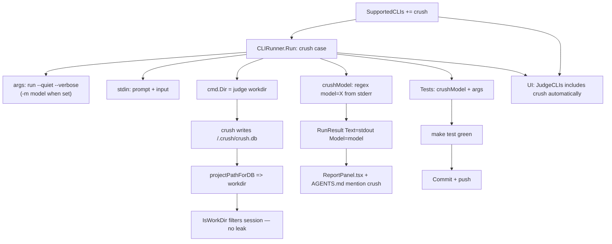

# Plan: Crush as a Judge CLI

**Date:** 2026-08-03 23:15
**Status:** ~~Ready to execute~~ Executed in `266bd64`. The UI/AGENTS doc
mentions (tasks 4–5) landed in the working tree on top of that commit.
**Goal:** Add `crush` alongside `claude` and `codex` as a supported judge CLI so a session can be evaluated without installing a second agent.

## Context

`internal/judge` evaluates a normalized trace by shelling out to a **sealed** local
agent CLI. Today only `claude` and `codex` are wired (`SupportedCLIs`,
`CLIRunner.Run` in `internal/judge/cli.go`). Users running mindwalk inside Crush
must install a _second_ agent CLI just to judge — pointless friction, since the
Crush CLI is already a capable non-interactive runner (`crush run`).

The user (Crush's author) confirms Crush is safe to run as the judge.

## Research findings (verified this session)

| Question                                                   | Answer                                                                                                                                                                                                        | How verified                                                                       |
| ---------------------------------------------------------- | ------------------------------------------------------------------------------------------------------------------------------------------------------------------------------------------------------------- | ---------------------------------------------------------------------------------- |
| Does `crush run` read a prompt from stdin?                 | **Yes** — with no prompt arg, the whole stdin is the prompt. Avoids argv size limits on big traces.                                                                                                           | `echo "..." \| crush run --quiet` replied correctly                                |
| Is stdout clean?                                           | **Yes** with `--quiet` — stdout is the reply text only, stderr empty.                                                                                                                                         | ran minimal prompts, inspected both streams                                        |
| Where does the model name come from?                       | `--verbose` emits `INFO ModelProvider called provider=X model=Y` on **stderr**; exactly one such line per run.                                                                                                | `grep model= verbose.txt` → single match                                           |
| Does `crush run` persist a session?                        | **Yes** — it creates `<cwd>/.crush/crush.db` and registers the project in `~/.local/share/crush/projects.json`.                                                                                               | ran from `/tmp/judgetest`, inspected `.crush/` and `projects.json`                 |
| Will that judge session leak into mindwalk's session list? | **No.** The Crush adapter derives `cwd` from the DB path via `projectPathForDB` (`projects.go:85`), which returns the workdir; `judge.IsWorkDir` then drops it (`sessions.go:188-190`). Same belt codex uses. | code path read end-to-end; identical mechanism to the codex `--ephemeral` fallback |
| Is the CLI list hardcoded in the UI?                       | **No** — server returns `JudgeCLIs []string` from `DetectCLIs()`; UI renders it generically.                                                                                                                  | grepped `web/src` and `internal/server/analyze.go`                                 |

**Conclusion:** the integration is low-risk and follows the exact pattern already
established for codex. The session-persistence concern — the one real difference
from claude/codex — is already handled by the existing `IsWorkDir` filter.

## Pareto breakdown

### 1% that delivers 51%

| #   | Task                                                                                              | File                    | Impact                           |
| --- | ------------------------------------------------------------------------------------------------- | ----------------------- | -------------------------------- |
| 1   | Add `crush` case to `CLIRunner.Run`: `run --quiet --verbose`, prompt via stdin, model from stderr | `internal/judge/cli.go` | The judge can actually use Crush |

### 4% that delivers 64%

| #   | Task                                                               | File                     | Impact                                              |
| --- | ------------------------------------------------------------------ | ------------------------ | --------------------------------------------------- |
| 2   | Add `"crush"` to `SupportedCLIs` (auto-surfaces in UI + detection) | `internal/judge/cli.go`  | Crush appears as a pickable judge with zero UI work |
| 3   | `crushModel` regex helper + test                                   | `cli.go` / `cli_test.go` | Reports name the judging model (comparability)      |

### 20% that delivers 80%

| #   | Task                                             | File                         | Impact                                  |
| --- | ------------------------------------------------ | ---------------------------- | --------------------------------------- |
| 4   | Update "Install claude or codex" → mention crush | `web/src/ui/ReportPanel.tsx` | Users learn crush is an option          |
| 5   | Update AGENTS.md judge CLI list                  | `AGENTS.md`                  | Future sessions know crush is supported |
| 6   | Tests: model parser + args shape                 | `cli_test.go`                | Prevent regressions                     |

### The other 20% (to 100%)

| #   | Task                                                                 | File | Impact     |
| --- | -------------------------------------------------------------------- | ---- | ---------- |
| 7   | Verify `make test` green; run a real judge round if a trace is handy | —    | Confidence |

## Execution graph

## Out of scope

- Adding CLI-level tool-stripping flags to Crush (upstream concern; not needed for this integration per the user).
- Changing the verdict model or report JSON shape (crush is just another runner; `RunResult` is unchanged).

---

## Resolution (2026-08-03)

All 7 tasks shipped. The plan is fully executed.

| #   | Task                                                                    | Status             | Evidence                                                       |
| --- | ----------------------------------------------------------------------- | ------------------ | -------------------------------------------------------------- |
| 1   | `crush` case in `CLIRunner.Run` (`run --quiet --verbose`, stdin prompt) | done at `266bd64`  | `internal/judge/cli.go:142`                                    |
| 2   | `"crush"` in `SupportedCLIs`                                            | done at `266bd64`  | `internal/judge/cli.go:32`                                     |
| 3   | `crushModel` regex helper + test                                        | done at `266bd64`  | `cli.go` + `TestCrushModelReadsVerboseLog` in `cli_test.go:43` |
| 4   | ReportPanel.tsx install hint mentions crush                             | done (uncommitted) | `web/src/ui/ReportPanel.tsx` working-tree change               |
| 5   | AGENTS.md judge CLI list mentions crush                                 | done (uncommitted) | `AGENTS.md` working-tree change                                |
| 6   | Tests: model parser + args shape                                        | done at `266bd64`  | `cli_test.go:43`                                               |
| 7   | `make test` green                                                       | done               | 11 packages green (judge `ok`)                                 |

Tasks 4–5 are the only unfinished thread: the doc/UI mentions exist as
uncommitted working-tree edits on top of `266bd64`. Committing them closes
the plan (see TODO_LIST "Commit the uncommitted judge-CLI docs").
